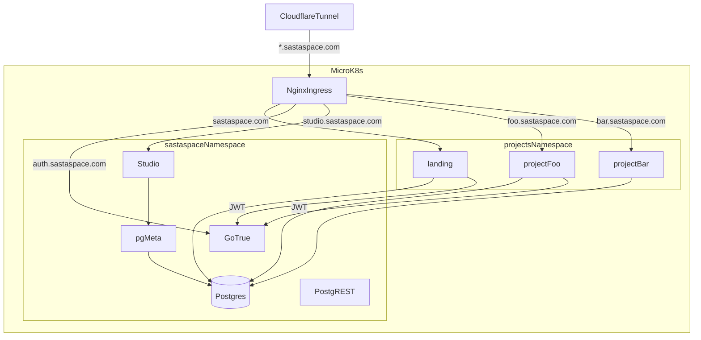

## Project

SastaSpace is a project-bank monorepo for building and showcasing multiple small projects on the `sastaspace.com` domain.

- Root portfolio: `projects/landing` (served at `sastaspace.com`)
- Per-project deploy target: `<name>.sastaspace.com`
- Shared database: `supabase/postgres` with 50+ extensions
- Shared auth: Supabase GoTrue at `auth.sastaspace.com`
- Shared DB admin: Supabase Studio at `studio.sastaspace.com` (gated by Cloudflare Access)
- Optional API accelerator: shared PostgREST

## Tech Stack

- Frontend: Next.js 16 (App Router) + TypeScript + Tailwind v4 + shadcn/ui
- Backend default: Go (`chi`, `pgx`, `sqlc`)
- Database: Postgres (`supabase/postgres`) with pgvector, PostGIS, pg_cron, pg_graphql, etc.
- Auth: Supabase GoTrue (email+password, magic link, Google, GitHub) with `@supabase/ssr` in Next
- Admin UI: Supabase Studio (DB browser + SQL + user management)
- Deployment: MicroK8s + Cloudflare tunnel
- CI/CD: GitHub Actions self-hosted runner

## Repository Layout

- `infra/k8s/` - shared Postgres, PostgREST, GoTrue, pg-meta, Studio, cloudflared, ingresses
- `infra/docker-compose.yml` - local mirror of shared services
- `db/migrations/` - extensions, shared schema, auth roles, admin allowlist, RLS helpers
- `db/seed/` - seed data scripts
- `projects/_template/` - default scaffold (Next.js + shadcn + Supabase auth + Go API)
- `projects/landing/` - `sastaspace.com` portfolio app
- `scripts/new-project.sh` - project scaffolder
- `design-log/` - design decisions and implementation history

## Conventions

- Project folders use kebab-case: `projects/my-project`
- Project schema naming: `project_<name>`
- Web app code in `projects/<name>/web`
- Go API code in `projects/<name>/api`
- Shared services in `infra/k8s`, per-project manifests in `projects/<name>/k8s.yaml`
- No secrets in git: only `.env.example` and `infra/k8s/secrets.yaml.template`
- Design log first for significant changes (see `design-log/`)

## Architecture

## Auth model

- GoTrue signs JWTs with `JWT_SECRET`; PostgREST validates with the same secret -> RLS works end to end.
- Roles in Postgres: `anon` (unauthenticated), `authenticated` (signed in), `service_role` (bypasses RLS), `authenticator` (PostgREST login role that SET ROLEs based on JWT).
- `public.admins(email)` table is the app-level admin allowlist. `public.is_admin()` returns true if the current user's email is in that list.
- `auth.uid()`, `auth.role()`, `auth.email()`, `auth.jwt()` helpers are available for RLS policies.
- Next.js projects use `@supabase/ssr` with a `proxy.ts` (renamed from `middleware.ts` in Next 16) to refresh auth cookies.

## Workflow

1. Add or update design log in `design-log/`
2. Use `make new p=<name>` (or `scripts/new-project.sh <name>`) for new apps
3. Add project DB migrations under `projects/<name>/db/migrations/`
4. Keep one project per subdomain and one `k8s.yaml` per project
5. Validate locally (`npm run build` in the project), then deploy via `.github/workflows/deploy.yml`

## References

- Foundation design: `design-log/001-project-bank-foundations.md`
- Auth + UI upgrade: `design-log/002-auth-admin-ui-upgrade.md`
- Root quickstart: `README.md`
