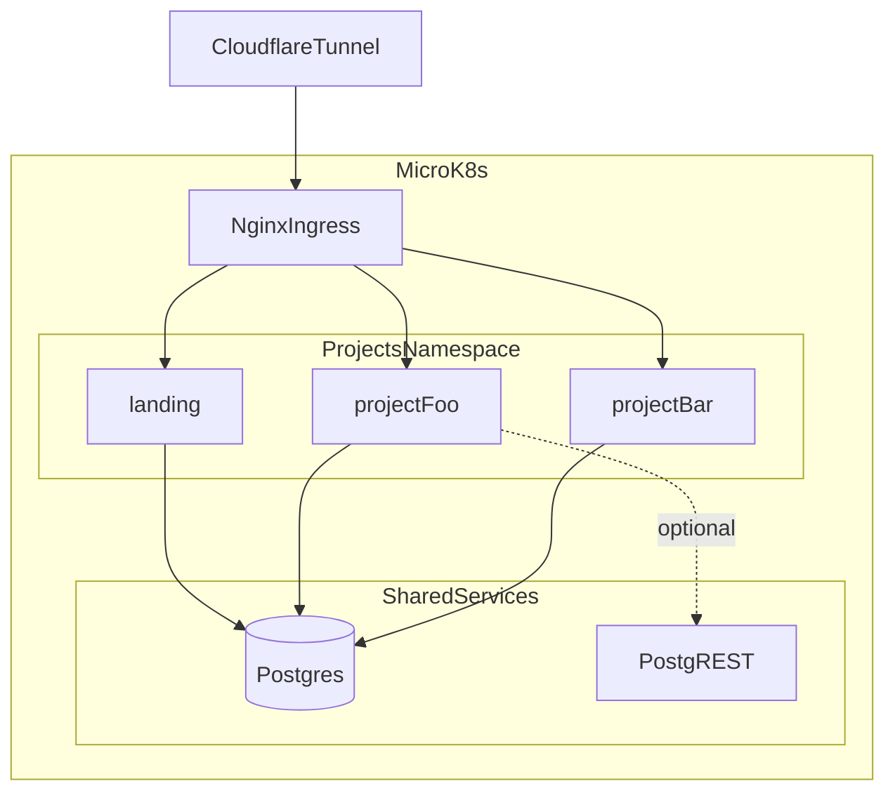

## Project

SastaSpace is now a project-bank monorepo for building and showcasing multiple small projects on the `sastaspace.com` domain.

- Root portfolio: `projects/landing`
- Per-project deploy target: `<name>.sastaspace.com`
- Shared database: `supabase/postgres` with extensions
- Optional API accelerator: shared `PostgREST`

## Tech Stack

- Frontend: Next.js 16 + TypeScript
- Backend default: Go (`chi`, `pgx`, `sqlc`)
- Database: Postgres (`supabase/postgres`)
- Deployment: MicroK8s + Cloudflare tunnel
- CI/CD: GitHub Actions self-hosted runner

## Repository Layout

- `infra/k8s/` - shared namespace, Postgres, PostgREST, cloudflared, ingress
- `infra/docker-compose.yml` - local shared services
- `db/migrations/` - extension and shared schema SQL
- `db/seed/` - seed data scripts
- `projects/_template/` - default scaffold for new projects
- `projects/landing/` - `sastaspace.com` portfolio app
- `scripts/new-project.sh` - project scaffolder

## Conventions

- Project folders use kebab-case: `projects/my-project`
- Project schema naming: `project_<name>`
- Web app code in `projects/<name>/web`
- Go API code in `projects/<name>/api`
- Infra remains minimal: shared services in `infra/k8s`, per-project manifests in `projects/<name>/k8s.yaml`
- No secrets in git; only `.env.example` and `infra/k8s/secrets.yaml.template`

## Architecture

## Workflow

1. Add or update design log in `design-log/`
2. Use `projects/_template` or `make new p=<name>` for new apps
3. Add project DB migrations under `projects/<name>/db/migrations/`
4. Keep one project per subdomain and one `k8s.yaml` per project
5. Validate locally, then deploy via `.github/workflows/deploy.yml`

## References

- Foundation design: `design-log/001-project-bank-foundations.md`
- Root quickstart: `README.md`
