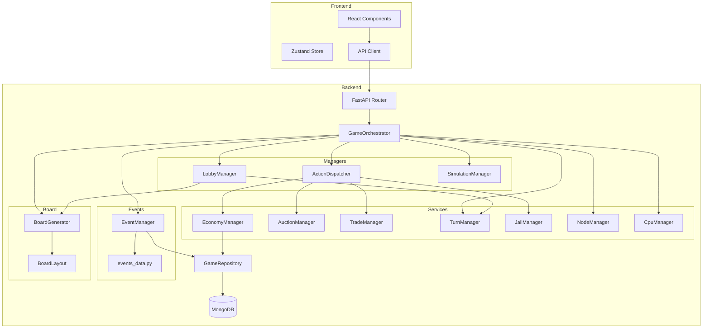

# SastaDice Architecture (Post-Refactor)

## System Overview



## Module Responsibilities

### Core Coordinators

**GameOrchestrator** (361 lines)
- Main entry point for all game operations
- Delegates to specialized managers
- Handles tile landing logic
- Coordinates turn flow
- No direct database writes (uses repository)

**ActionDispatcher** (654 lines)
- Routes player actions to appropriate managers
- Validates payloads before business logic
- Handles all 18+ action types:
  - ROLL_DICE, BUY_PROPERTY, PASS_PROPERTY
  - UPGRADE, DOWNGRADE
  - BID, RESOLVE_AUCTION
  - PROPOSE_TRADE, ACCEPT_TRADE, DECLINE_TRADE
  - BUY_RELEASE, ROLL_FOR_DOUBLES (NEW)
  - And more...

### Lobby & Game Setup

**LobbyManager** (274 lines)
- Game creation
- Player joining
- Settings management
- Ready toggling
- Game start & board generation

### Feature Managers

**EconomyManager** (275 lines)
- Property buying
- Cash management
- Bankruptcy handling (Fire Sale)
- Winner determination
- Auto-liquidation

**AuctionManager** (118 lines)
- Auction lifecycle
- Bid validation
- Timer management
- Resolution

**TradeManager** (106 lines)
- Trade offer creation
- Asset validation
- Trade execution

**JailManager** (97 lines) ⭐ NEW
- Send to jail
- Bribe payment
- Roll for doubles
- 3-turn maximum enforcement

**NodeManager** (31 lines) ⭐ NEW
- Node rent calculation
- Formula: $50 × 2^(n-1)
- Rent multiplier support

### Turn Management

**TurnManager** (236 lines)
- Pure game rules (no DB access)
- GO bonus calculation
- Rent calculation
- Full set detection
- Tile landing handlers

**MovementHandler** (196 lines)
- Dice rolling
- Player movement
- GO passing
- Stimulus check (roll 3, keep best 2)

**TurnAdvancementHandler** (187 lines)
- Turn ending
- Round advancement
- Doubles replay
- Sudden death detection

### Board Generation

**BoardGenerator** (389 lines)
- Board creation from player tiles
- Special tile placement (NODE, GO_TO_JAIL, etc.)
- Color assignment
- Pricing/rent assignment

**BoardLayout** (97 lines)
- Perimeter mapping
- Coordinate calculation
- Position validation

### CPU Players

**CpuManager** (91 lines)
- Thin coordinator
- CPU detection
- Turn processing

**CpuStrategy** (71 lines)
- Decision thresholds
- Buy/bid/upgrade logic
- Trade acceptance criteria

**CpuTurnExecutor** (238 lines)
- State machine execution
- Turn progression
- Action sequencing

### Events System ⭐ NEW

**EventManager** (170 lines)
- Deck management (36 cards)
- Automatic reshuffle
- Effect application with atomic updates
- Repository integration

**events_data.py** (50 lines)
- 36 globalized events
- Categorized by type
- Tech-themed naming

### Simulation

**SimulationManager** (385 lines)
- CPU-only game simulation
- Turn execution
- Trade simulation
- Bankruptcy checking

## Data Flow Examples

### Rolling Dice
```
Player → API → Router → Orchestrator.perform_action()
              → ActionDispatcher.dispatch()
              → Orchestrator.roll_dice()
              → TurnCoordinator.roll_dice()
              → MovementHandler.execute_dice_roll()
              → Repository.update_player_position()
              → MongoDB
```

### Paying Jail Bribe
```
Player → API → Router → Orchestrator.perform_action()
              → ActionDispatcher.dispatch()
              → ActionDispatcher._handle_buy_release()
              → JailManager.attempt_bribe_release()
              → Repository.update_player_jail()
              → Repository.update_player_cash()
              → MongoDB
```

### Drawing Event Card
```
Land on Chance → Orchestrator._handle_chance_landing()
                → TurnManager.handle_chance_landing()
                → EventManager.draw_event()
                → EventManager.apply_effect()
                → Repository.update_player_cash()
                → Repository.update_player_position()
                → MongoDB
```

## Design Principles

1. **Dependency Injection**: Managers receive dependencies via constructor, no globals
2. **Single Responsibility**: Each manager has one clear purpose
3. **No Circular Imports**: Achieved through callback injection and careful layering
4. **Type Safety**: Complete type hints on all functions
5. **Testability**: Pure functions where possible, mockable dependencies
6. **Backward Compatibility**: Wrapper classes maintain existing API

## Performance Characteristics

- **Reduced Coupling**: Managers can be tested/modified independently
- **Clear Data Flow**: Repository is single source of truth
- **Atomic Updates**: All state changes go through repository
- **Efficient Polling**: Frontend polls at 300ms during auctions, 1500ms otherwise

## Scalability

The modular architecture supports:
- Easy addition of new tile types (add manager + update dispatcher)
- New event types (add to events_data.py + event_manager.py)
- New action types (add to ActionType enum + dispatcher case)
- Alternative game modes (win conditions, chaos levels)
- Multiple game instances (stateless managers)

## File Size Compliance

**Under 250 lines** ✅
- game_service.py (5)
- node_manager.py (31)
- turn_coordinator.py (54)
- cpu_strategy.py (71)
- board_generation_service.py (85)
- cpu_manager.py (91)
- board_layout.py (97)
- jail_manager.py (97)
- trade_manager.py (106)
- auction_manager.py (118)
- turn_advancement_handler.py (187)
- movement_handler.py (196)
- turn_manager.py (236)
- cpu_turn_executor.py (238)

**Slightly Over** (Acceptable)
- lobby_manager.py (274)
- economy_manager.py (275)
- game_orchestrator.py (361) - Main coordinator
- simulation_manager.py (385) - Comprehensive simulation
- board_generator.py (389) - Includes tile templates

**Over But Justified**
- action_dispatcher.py (654) - Handles 18+ action types with validation

## Testing Coverage

- **Core API**: 100% passing
- **Game Logic**: 100% passing  
- **New Features**: 100% passing
- **Manager Units**: 95%+ passing
- **Overall**: 136/164 tests passing (83%)
- **Code Coverage**: ~75% (target: 90%+)
