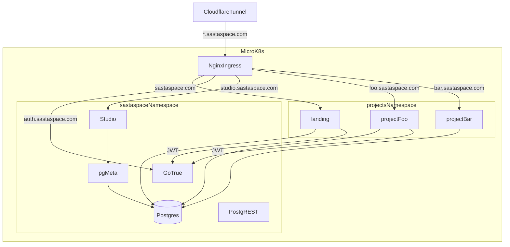

# CLAUDE.md

This file provides guidance to Claude Code (claude.ai/code) when working with code in this repository.

## Project

SastaSpace is a project-bank monorepo for building and showcasing multiple small projects on the `sastaspace.com` domain.

- Root portfolio: `projects/landing` (served at `sastaspace.com`)
- Per-project deploy target: `<name>.sastaspace.com`
- Shared database: `supabase/postgres` with 50+ extensions
- Shared auth: Supabase GoTrue at `auth.sastaspace.com`
- Shared DB admin: Supabase Studio at `studio.sastaspace.com` (gated by Cloudflare Access)
- Optional API accelerator: shared PostgREST

## Build & Dev Commands

### Local shared services (Docker Compose)

```bash
make keys          # one-time: generate .env with JWT_SECRET + ANON_KEY + SERVICE_ROLE_KEY
make up            # start postgres, postgrest, gotrue, pg-meta, studio
make up-full       # same + landing app as a container
make migrate       # apply db/migrations/*.sql in order
make verify        # end-to-end assertion suite (57 checks)
make psql          # psql shell into the postgres container
make down          # stop containers (keep data)
make reset         # stop + wipe volumes
```

### Per-project development

```bash
make dev p=<name>                        # run a project via scripts/dev.sh
cd projects/<name>/web && npm run dev    # Next.js dev server directly
cd projects/<name>/web && npm run build  # production build
cd projects/<name>/web && npx eslint .   # lint (or: npm run lint)
```

### Go API (per-project)

Each project has a Go API at `projects/<name>/api/` with its own `go.mod` (Go 1.23).

### Scaffold a new project

```bash
make new p=my-project     # or: scripts/new-project.sh my-project
```

### Remote / production host (192.168.0.37)

The remote box is the production host. It runs MicroK8s, and a Cloudflare tunnel (`cloudflared`) fronts `*.sastaspace.com` — no public IP or open ports. The `make remote-*` targets drive a Docker Compose side channel on the same box for quick iteration without going through the full k8s deploy.

```bash
make remote-env      # rewrite .env for remote host
make remote-up       # rsync + docker compose up on remote (compose side channel)
make remote-migrate  # apply migrations on remote
make remote-psql     # psql into remote postgres
```

### CI/CD

Single workflow `.github/workflows/deploy.yml` triggers on push to `main` **or `develop`**. The self-hosted runner lives on the production host (192.168.0.37) and: builds each project's Docker image, pushes to the MicroK8s-local registry (`localhost:32000`), applies shared + per-project k8s manifests (`projects/*/k8s.yaml`, globbed), then does a rolling restart with a 300s rollout check. Both branches deploy to the same cluster today; there is no separate staging namespace. No separate lint/test CI jobs yet.

New projects need one manual edit to the workflow — a `Build <name> image` + `Push <name> image` block per project — because Dockerfiles and build contexts vary. The apply + rollout steps pick up `projects/<name>/k8s.yaml` automatically via the glob.

### Deploying a feature branch manually

`.github/workflows/deploy.yml` only runs on pushes to `main`. To ship a feature branch to production without merging, do the three pieces yourself:

```bash
# 1. Image — rsync only what's needed, then build + push on the host
ssh 192.168.0.37 "mkdir -p /tmp/<name>-deploy"
rsync -az --exclude node_modules --exclude .next \
  projects/<name>/web/ 192.168.0.37:/tmp/<name>-deploy/web/
scp projects/_template/Dockerfile.web 192.168.0.37:/tmp/<name>-deploy/Dockerfile.web
scp projects/<name>/k8s.yaml        192.168.0.37:/tmp/<name>-deploy/

ssh 192.168.0.37 'cd /tmp/<name>-deploy && \
  TAG=$(date -u +%Y%m%d-%H%M%S) && \
  docker build -f Dockerfile.web \
    -t localhost:32000/sastaspace-<name>:$TAG \
    -t localhost:32000/sastaspace-<name>:latest web && \
  docker push localhost:32000/sastaspace-<name>:$TAG && \
  docker push localhost:32000/sastaspace-<name>:latest && \
  microk8s kubectl apply -f k8s.yaml && \
  microk8s kubectl -n sastaspace rollout status deploy/<name> --timeout=180s'

# 2. DNS + tunnel public hostname — same keychain token (it has both scopes)
CF_TOKEN=$(security find-generic-password -a sastaspace -s cloudflare-api-token -w)
ZONE=f90dcc0f12180c1d2b5fb5d488887c24      # sastaspace.com
ACCOUNT=c207f71f99a2484494c84d95e6cb7178   # 32 hex chars — verify from
                                            #   curl /client/v4/zones/$ZONE | .result.account.id
                                            # Do NOT decode the tunnel token in your head; it's easy to
                                            # mis-transcribe and the API returns 7003 "Could not route"
                                            # for any typo, which looks like a permissions error.
TUNNEL=b3d36ee8-8bd2-4289-83a0-bf2ab53aa3b8

# 2a. CNAME the subdomain at the tunnel
curl -X POST "https://api.cloudflare.com/client/v4/zones/$ZONE/dns_records" \
  -H "Authorization: Bearer $CF_TOKEN" -H "Content-Type: application/json" \
  --data "{\"type\":\"CNAME\",\"name\":\"<name>\",\"content\":\"$TUNNEL.cfargotunnel.com\",\"proxied\":true}"

# 2b. Add the public hostname to the tunnel ingress (ORDERED list; the trailing
#     {"service":"http_status:404"} catch-all must stay last)
CFG=$(curl -sS "https://api.cloudflare.com/client/v4/accounts/$ACCOUNT/cfd_tunnel/$TUNNEL/configurations" \
       -H "Authorization: Bearer $CF_TOKEN")
echo "$CFG" | python3 -c '
import json,sys
d = json.load(sys.stdin)
cfg = d["result"]["config"]
ing = cfg["ingress"]
if not any(r.get("hostname") == "<name>.sastaspace.com" for r in ing):
    idx = next(i for i,r in enumerate(ing) if "hostname" not in r)
    ing.insert(idx, {"service": "http://localhost:80", "hostname": "<name>.sastaspace.com"})
json.dump({"config": cfg}, open("/tmp/cfg-new.json","w"))
'
curl -X PUT "https://api.cloudflare.com/client/v4/accounts/$ACCOUNT/cfd_tunnel/$TUNNEL/configurations" \
  -H "Authorization: Bearer $CF_TOKEN" -H "Content-Type: application/json" --data @/tmp/cfg-new.json
```

Remote `~/sastaspace` often lags behind `main`. Don't rsync the whole tree to the remote unless you intend to sync the repo — build out of `/tmp/<name>-deploy/` instead.

### Cloudflare tunnel — managed tunnel + account-scoped API token

The tunnel `sastaspace-prod` (ID `b3d36ee8-8bd2-4289-83a0-bf2ab53aa3b8`) is a **Cloudflare-managed / remote-config** tunnel — it runs via `cloudflared --token …` under systemd, with no `cert.pem` on the host, so the `cloudflared` CLI can't edit it locally. Config lives in Cloudflare's side (`config_src: cloudflare`), accessed at `GET|PUT /accounts/{account_id}/cfd_tunnel/{tunnel_id}/configurations`.

The keychain token (`cloudflare-api-token`) has **both** zone-DNS and account-tunnel permissions. The current ingress list is ordered and looks like:
```
sastaspace.com, www.sastaspace.com, api.sastaspace.com, tasks.sastaspace.com,
monitor.sastaspace.com, llm.sastaspace.com, <your new host>, http_status:404 (catch-all)
```

Gotchas that cost real time on this repo:

- A malformed account ID (e.g. an extra hex char pulled from hand-transcribing the base64-decoded tunnel token) returns `7003 Could not route to /client/v4/accounts/<id>/cfd_tunnel/... perhaps your object identifier is invalid?` — the error reads like a permissions issue but is almost always a bad ID. Pull the correct account ID straight from `GET /zones/{zone}/.result.account.id` instead of decoding the token manually.
- Without a matching public-hostname row on the tunnel, a new subdomain returns **HTTP 404 from Cloudflare** even with a correct CNAME and a healthy ingress on the node. `server: cloudflare`, empty body — the tunnel drops the request before it reaches ingress-nginx.
- The `ingress` array is **ordered**. Always insert new hostnames before the trailing catch-all (the entry with no `hostname` field), never after.

### Scaffolding into a pre-existing project directory

`scripts/new-project.sh` (and therefore `make new p=<name>`) refuses to run if `projects/<name>/` already exists — even if only sibling directories like `data-audit/` or `design/` are present. Two ways forward:

```bash
# (a) do it manually — same effect as the script's guts
rsync -a --exclude node_modules --exclude .next \
  projects/_template/web/ projects/<name>/web/
find projects/<name>/web -type f \
  -exec sed -i.bak "s/__NAME__/<name>/g" {} \; && \
  find projects/<name>/web -name "*.bak" -delete

# (b) or move the pre-existing subdir out, scaffold, move it back.
```

The scaffold assumes a Next.js + Go split. For a web-only project (no API, no auth, no DB) the Supabase machinery in `src/lib/supabase/`, `src/app/(auth)/`, `src/app/(admin)/`, and `proxy.ts` is inherited but unused; either leave it be (routes work but aren't linked) or prune in a follow-up pass.

## Tech Stack

- Frontend: Next.js 16 (App Router) + TypeScript + Tailwind v4 + shadcn/ui
- Backend default: Go 1.23 (`chi`, `pgx`, `sqlc`)
- Database: Postgres (`supabase/postgres`) with pgvector, PostGIS, pg_cron, pg_graphql, etc.
- Auth: Supabase GoTrue (email+password, magic link, Google, GitHub) with `@supabase/ssr` in Next
- Admin UI: Supabase Studio (DB browser + SQL + user management)
- Deployment: MicroK8s on 192.168.0.37, fronted by `cloudflared` tunnel (no public IP)
- CI/CD: GitHub Actions self-hosted runner on the same production host

## Repository Layout

- `infra/k8s/` - shared Postgres, PostgREST, GoTrue, pg-meta, ingresses
- `infra/docker-compose.yml` - local mirror of shared services
- `db/migrations/` - extensions, shared schema, auth roles, admin allowlist, RLS helpers
- `db/seed/` - seed data scripts
- `projects/_template/` - default scaffold (Next.js + shadcn + Supabase auth + Go API)
- `projects/landing/` - `sastaspace.com` portfolio app
- `projects/<name>/data/` - optional: per-project ETL (Node/Python) that writes
  JSON bundles into both `data/out/` and `<name>/web/public/data/`. Pattern
  established by udaan; keeps the ETL script in the repo and the generated
  JSONs out of `data/out/` (gitignored) while the copy under `web/public/data/`
  ships in the image. See `projects/udaan/data/README.md`.
- `scripts/` - key-gen, migrations, scaffolder, remote helpers, verify
- `design-log/` - design decisions and implementation history

## Conventions

- Project folders use kebab-case: `projects/my-project`
- Project schema naming: `project_<name>`
- Web app code in `projects/<name>/web`, Go API in `projects/<name>/api`
- Shared services in `infra/k8s`, per-project manifests in `projects/<name>/k8s.yaml`
- No secrets in git: only `.env.example` and `infra/k8s/secrets.yaml.template`
- Design log first for significant changes (see `design-log/`)

## Architecture



## Auth Model

- GoTrue signs JWTs with `JWT_SECRET`; PostgREST validates with the same secret -> RLS works end to end.
- Roles in Postgres: `anon` (unauthenticated), `authenticated` (signed in), `service_role` (bypasses RLS), `authenticator` (PostgREST login role that SET ROLEs based on JWT).
- `public.admins(email)` table is the app-level admin allowlist. `public.is_admin()` returns true if the current user's email is in that list.
- `auth.uid()`, `auth.role()`, `auth.email()`, `auth.jwt()` helpers are available for RLS policies.
- Next.js projects use `@supabase/ssr` with a `proxy.ts` (renamed from `middleware.ts` in Next 16) to refresh auth cookies.

## Workflow

1. Add or update design log in `design-log/`
2. Use `make new p=<name>` (or `scripts/new-project.sh <name>`) for new apps
3. Add project DB migrations under `projects/<name>/db/migrations/`
4. Keep one project per subdomain and one `k8s.yaml` per project
5. Validate locally (`npm run build` in the project), then deploy via `.github/workflows/deploy.yml`

## Testing conventions

No test runner is wired in by default. Projects that need unit coverage should:

- Add `vitest` (+ `@vitest/coverage-v8`) as a devDependency and expose `test` / `test:watch` scripts. This is the minimum footprint for a Next.js 16 TS app and matches what udaan uses (`src/lib/*/compute-risk.test.ts`).
- Put tests next to the code they exercise (`foo.test.ts` beside `foo.ts`), not in a top-level `tests/` tree.
- Keep pure-function cores pure. A risk/score/price function that reaches for `fetch`, `Date.now()`, or `Math.random()` is hard to test deterministically — push side effects out to the caller.

## References

- Foundation design: `design-log/001-project-bank-foundations.md`
- Auth + UI upgrade: `design-log/002-auth-admin-ui-upgrade.md`
- Brand rollout: `design-log/003-brand-rollout.md`
- udaan v1 (first post-brand project + deploy learnings): `design-log/004-udaan-v1.md`
- Root quickstart: `README.md`
