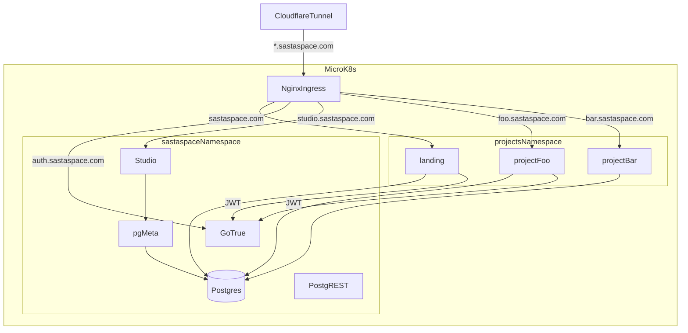

# CLAUDE.md

This file provides guidance to Claude Code (claude.ai/code) when working with code in this repository.

## Project

SastaSpace is a project-bank monorepo for building and showcasing multiple small projects on the `sastaspace.com` domain.

- Root portfolio: `projects/landing` (served at `sastaspace.com`)
- Per-project deploy target: `<name>.sastaspace.com`
- Shared database: `supabase/postgres` with 50+ extensions
- Shared auth: Supabase GoTrue at `auth.sastaspace.com`
- Shared DB admin: Supabase Studio at `studio.sastaspace.com` (gated by Cloudflare Access)
- Optional API accelerator: shared PostgREST

## Build & Dev Commands

### Local shared services (Docker Compose)

```bash
make keys          # one-time: generate .env with JWT_SECRET + ANON_KEY + SERVICE_ROLE_KEY
make up            # start postgres, postgrest, gotrue, pg-meta, studio
make up-full       # same + landing app as a container
make migrate       # apply db/migrations/*.sql in order
make verify        # end-to-end assertion suite (57 checks)
make psql          # psql shell into the postgres container
make down          # stop containers (keep data)
make reset         # stop + wipe volumes
```

### Per-project development

```bash
make dev p=<name>                        # run a project via scripts/dev.sh
cd projects/<name>/web && npm run dev    # Next.js dev server directly
cd projects/<name>/web && npm run build  # production build
cd projects/<name>/web && npx eslint .   # lint (or: npm run lint)
```

### Go API (per-project)

Each project has a Go API at `projects/<name>/api/` with its own `go.mod` (Go 1.23).

### Scaffold a new project

```bash
make new p=my-project     # or: scripts/new-project.sh my-project
```

### Remote / production host (192.168.0.37)

The remote box is the production host. It runs MicroK8s, and a Cloudflare tunnel (`cloudflared`) fronts `*.sastaspace.com` — no public IP or open ports. The `make remote-*` targets drive a Docker Compose side channel on the same box for quick iteration without going through the full k8s deploy.

```bash
make remote-env      # rewrite .env for remote host
make remote-up       # rsync + docker compose up on remote (compose side channel)
make remote-migrate  # apply migrations on remote
make remote-psql     # psql into remote postgres
```

### CI/CD

Single workflow `.github/workflows/deploy.yml` triggers on push to `main`. The self-hosted runner lives on the production host (192.168.0.37) and: builds Docker images, pushes to the MicroK8s-local registry (`localhost:32000`), applies shared + per-project k8s manifests, then does a rolling restart with a 300s rollout check. The Cloudflare tunnel already has the routes, so new pods are live on `*.sastaspace.com` without any DNS changes. No separate lint/test CI jobs yet.

## Tech Stack

- Frontend: Next.js 16 (App Router) + TypeScript + Tailwind v4 + shadcn/ui
- Backend default: Go 1.23 (`chi`, `pgx`, `sqlc`)
- Database: Postgres (`supabase/postgres`) with pgvector, PostGIS, pg_cron, pg_graphql, etc.
- Auth: Supabase GoTrue (email+password, magic link, Google, GitHub) with `@supabase/ssr` in Next
- Admin UI: Supabase Studio (DB browser + SQL + user management)
- Deployment: MicroK8s on 192.168.0.37, fronted by `cloudflared` tunnel (no public IP)
- CI/CD: GitHub Actions self-hosted runner on the same production host

## Repository Layout

- `infra/k8s/` - shared Postgres, PostgREST, GoTrue, pg-meta, ingresses
- `infra/docker-compose.yml` - local mirror of shared services
- `db/migrations/` - extensions, shared schema, auth roles, admin allowlist, RLS helpers
- `db/seed/` - seed data scripts
- `projects/_template/` - default scaffold (Next.js + shadcn + Supabase auth + Go API)
- `projects/landing/` - `sastaspace.com` portfolio app
- `scripts/` - key-gen, migrations, scaffolder, remote helpers, verify
- `design-log/` - design decisions and implementation history

## Conventions

- Project folders use kebab-case: `projects/my-project`
- Project schema naming: `project_<name>`
- Web app code in `projects/<name>/web`, Go API in `projects/<name>/api`
- Shared services in `infra/k8s`, per-project manifests in `projects/<name>/k8s.yaml`
- No secrets in git: only `.env.example` and `infra/k8s/secrets.yaml.template`
- Design log first for significant changes (see `design-log/`)

## Architecture



## Auth Model

- GoTrue signs JWTs with `JWT_SECRET`; PostgREST validates with the same secret -> RLS works end to end.
- Roles in Postgres: `anon` (unauthenticated), `authenticated` (signed in), `service_role` (bypasses RLS), `authenticator` (PostgREST login role that SET ROLEs based on JWT).
- `public.admins(email)` table is the app-level admin allowlist. `public.is_admin()` returns true if the current user's email is in that list.
- `auth.uid()`, `auth.role()`, `auth.email()`, `auth.jwt()` helpers are available for RLS policies.
- Next.js projects use `@supabase/ssr` with a `proxy.ts` (renamed from `middleware.ts` in Next 16) to refresh auth cookies.

## Workflow

1. Add or update design log in `design-log/`
2. Use `make new p=<name>` (or `scripts/new-project.sh <name>`) for new apps
3. Add project DB migrations under `projects/<name>/db/migrations/`
4. Keep one project per subdomain and one `k8s.yaml` per project
5. Validate locally (`npm run build` in the project), then deploy via `.github/workflows/deploy.yml`

## References

- Foundation design: `design-log/001-project-bank-foundations.md`
- Auth + UI upgrade: `design-log/002-auth-admin-ui-upgrade.md`
- Root quickstart: `README.md`
