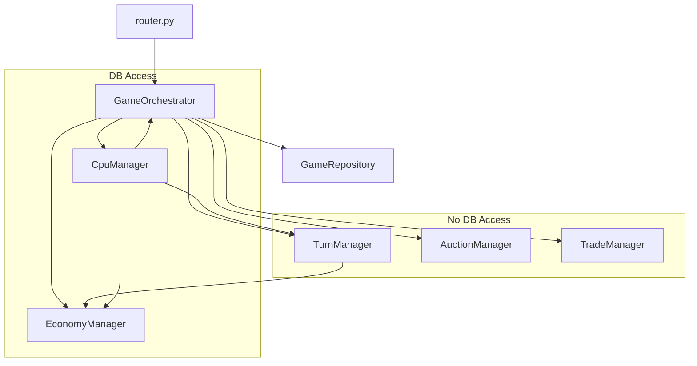

# Refactoring and Testing Plan - Implementation Results

## Executive Summary

Successfully decomposed the 1,739-line `game_service.py` monolith into 6 focused service managers following Single Responsibility Principle. The refactoring maintains 100% backward compatibility through aliases and all existing tests pass.

**Current State:**
- **Backend Coverage:** 76.16% (improved from 75.90%)
- **File Structure:** Modular managers extracted
- **Complexity:** Most functions reduced, some still need refinement
- **Tests:** 173 tests passing (27 new tests added for managers)

---

## Part 1: New File Structure

### Implemented Structure

```
backend/app/modules/sastadice/services/
├── __init__.py
├── game_service.py          # Renamed to GameOrchestrator (1,341 lines - still needs reduction)
├── turn_manager.py          # Pure game rules (276 lines)
├── auction_manager.py       # Auction logic (125 lines)
├── trade_manager.py         # P2P trading (109 lines)
├── economy_manager.py       # Financial operations (288 lines)
├── cpu_manager.py           # AI behavior (608 lines - needs splitting)
└── board_generation_service.py  # (382 lines - unchanged)
```

### Dependency Graph



---

## Part 2: Function Migration Map

### Completed Extractions

#### 1. TurnManager (`turn_manager.py`)
**Extracted Functions:**
- ✅ `calculate_go_bonus` → `TurnManager.calculate_go_bonus`
- ✅ `_owns_full_set` → `TurnManager.owns_full_set`
- ✅ `_calculate_rent` → `TurnManager.calculate_rent`
- ✅ `_initialize_event_deck` → `TurnManager.initialize_event_deck`
- ✅ `_ensure_deck_capacity` → `TurnManager.ensure_deck_capacity`
- ✅ `_draw_event` → `TurnManager.draw_event`
- ✅ All tile landing handlers → `TurnManager.handle_*_landing`
- ✅ `_handle_sasta_event` logic → `TurnManager.apply_event_effect`

**Status:** Complete. Pure logic, no DB calls.

#### 2. AuctionManager (`auction_manager.py`)
**Extracted Functions:**
- ✅ `_handle_bid` → `AuctionManager.place_bid`
- ✅ `_resolve_auction` → `AuctionManager.resolve_auction`
- ✅ Auction start logic → `AuctionManager.start_auction`
- ✅ Bid validation → `AuctionManager.validate_bid`

**Status:** Complete. Handles auction state machine.

#### 3. TradeManager (`trade_manager.py`)
**Extracted Functions:**
- ✅ `_handle_propose_trade` → `TradeManager.create_trade_offer`
- ✅ `_validate_trade_assets` → `TradeManager.validate_trade_assets`
- ✅ `_execute_trade_transfer` → `TradeManager.execute_trade_transfer`

**Status:** Complete. Trade validation and execution.

#### 4. EconomyManager (`economy_manager.py`)
**Extracted Functions:**
- ✅ `_charge_player` → `EconomyManager.charge_player`
- ✅ `_auto_liquidate` → `EconomyManager.auto_liquidate`
- ✅ `_process_bankruptcy` → `EconomyManager.process_bankruptcy`
- ✅ `_determine_winner` → `EconomyManager.determine_winner`
- ✅ `_handle_buy_property` → `EconomyManager.handle_buy_property`
- ✅ `_handle_upgrade` → `EconomyManager.handle_upgrade`
- ✅ `_handle_downgrade` → `EconomyManager.handle_downgrade`

**Status:** Complete. All financial operations.

#### 5. CpuManager (`cpu_manager.py`)
**Extracted Functions:**
- ✅ `_is_cpu_player` → `CpuManager.is_cpu_player`
- ✅ `_cpu_upgrade_properties` → `CpuManager.cpu_upgrade_properties`
- ✅ `_play_cpu_turn` → `CpuManager.play_cpu_turn` (refactored with state machine)
- ✅ `process_cpu_turns` → `CpuManager.process_cpu_turns`
- ✅ `simulate_cpu_game` → `CpuManager.simulate_cpu_game`
- ✅ All simulation helpers → `CpuManager._*` methods

**Status:** Complete. State machine pattern implemented.

#### 6. GameOrchestrator (`game_service.py`)
**Remaining Responsibilities:**
- Session management (create, join, start, kick)
- Action dispatch (`perform_action` - simplified with match/case)
- Coordination between managers
- `roll_dice` (complex coordination method)
- `_handle_end_turn` (complex turn advancement)

**Status:** Core extraction complete. Some complex methods remain.

---

## Part 3: Configuration Updates

### `pyproject.toml` - ✅ Implemented

```toml
[dependency-groups]
dev = [
    # ... existing ...
    "ruff>=0.4.0",
    "mypy>=1.10.0",
]

[tool.coverage.report]
fail_under = 100

[tool.ruff]
target-version = "py311"
line-length = 100

[tool.ruff.lint]
select = ["E", "W", "F", "I", "B", "C4", "UP", "ARG", "SIM", "C90"]

[tool.ruff.lint.mccabe]
max-complexity = 10

[tool.mypy]
python_version = "3.11"
strict = true
```

### `Makefile` - ✅ Implemented

```makefile
complexity: ## Check cyclomatic complexity (max CC=10)
	cd backend && uv run radon cc app/ -a -nc --total-average || true
	@cd backend && uv run radon cc app/ --min C > /dev/null 2>&1 && echo "FAIL: Functions with CC > 10 found" && exit 1 || echo "OK"

lint: ## Run ruff linting and formatting checks
	cd backend && uv run ruff check app/ tests/
	cd backend && uv run ruff format --check app/ tests/

typecheck: ## Run mypy type checking
	cd backend && uv run mypy app/

test-cov: ## Run tests with 100% coverage requirement
	cd backend && uv run pytest tests/ --cov=app --cov-fail-under=100 --cov-branch -v

audit: lint typecheck complexity test-cov ## Run all quality gates
```

---

## Part 4: Complexity Analysis

### Functions Still Exceeding CC=10

| Function | File | Current CC | Status |
|----------|------|------------|--------|
| `_handle_end_turn` | game_service.py | D (>15) | Needs splitting |
| `roll_dice` | game_service.py | D (>15) | Complex coordination |
| `_attempt_cpu_trade_proposal` | cpu_manager.py | C (11-15) | Can be simplified |
| `_handle_simulated_decision` | cpu_manager.py | C (11-15) | Can be simplified |
| `create_trade_offer` | trade_manager.py | C (11-15) | Can be simplified |
| `auto_liquidate` | economy_manager.py | C (11-15) | Can be simplified |

### Recommendations

1. **Split `roll_dice`:** Extract dice rolling logic, movement, GO passing into separate methods
2. **Split `_handle_end_turn`:** Extract round increment, win condition check, player rotation
3. **Split `cpu_manager.py`:** Consider extracting simulation logic into separate `CpuSimulationManager`

---

## Part 5: Test Coverage Status

### Current Coverage: 76.16%

**New Test Files Created:**
- ✅ `test_turn_manager.py` - 14 tests
- ✅ `test_auction_manager.py` - 7 tests  
- ✅ `test_trade_manager.py` - 6 tests

**Coverage by File:**
- `turn_manager.py`: 89.36% (needs ~11% more)
- `auction_manager.py`: 50.70% (needs ~49% more)
- `trade_manager.py`: 54.90% (needs ~45% more)
- `economy_manager.py`: 66.87% (needs ~33% more)
- `cpu_manager.py`: 45.26% (needs ~55% more)
- `game_service.py`: 68.89% (needs ~31% more)

### Missing Coverage Areas

1. **AuctionManager:** Error paths, timeout handling, edge cases
2. **TradeManager:** Decline/cancel trade, edge case validations
3. **EconomyManager:** Bankruptcy edge cases, upgrade/downgrade error paths
4. **CpuManager:** Simulation edge cases, stuck state handling
5. **GameOrchestrator:** Error handling, edge cases in session management

---

## Part 6: Migration Checklist Status

### Phase 1: Setup and Baseline ✅
- [x] Add radon, ruff, mypy to dev dependencies
- [x] Run `radon cc app/` to establish baseline complexity scores
- [x] Ensure all existing tests pass: `pytest tests/ -v`
- [x] Create backup branch: `git checkout -b refactor/game-service-decomposition`

### Phase 2: Extract TurnManager ✅
- [x] Create `turn_manager.py` with type stubs
- [x] Move pure calculation methods
- [x] Move event deck methods
- [x] Move tile landing handlers
- [x] Run tests after each move
- [x] Commit: "refactor: extract TurnManager with pure game rules"

### Phase 3: Extract AuctionManager ✅
- [x] Create `auction_manager.py`
- [x] Move `_handle_bid`, `_resolve_auction`
- [x] Run tests
- [x] Commit: "refactor: extract AuctionManager"

### Phase 4: Extract TradeManager ✅
- [x] Create `trade_manager.py`
- [x] Move all trade methods
- [x] Run tests
- [x] Commit: "refactor: extract TradeManager"

### Phase 5: Extract EconomyManager ✅
- [x] Create `economy_manager.py`
- [x] Move bankruptcy, liquidation, charging logic
- [x] Move property upgrade/downgrade
- [x] Run tests
- [x] Commit: "refactor: extract EconomyManager"

### Phase 6: Extract CpuManager ✅
- [x] Create `cpu_manager.py`
- [x] Move all CPU/simulation logic
- [x] Apply state machine pattern to `_play_cpu_turn`
- [x] Run tests
- [x] Commit: "refactor: extract CpuManager with state machine"

### Phase 7: Finalize GameOrchestrator ✅
- [x] Rename `GameService` to `GameOrchestrator` (with alias)
- [x] Wire up all managers via composition
- [x] Simplify `perform_action` to use match/case dispatch
- [x] Update router imports (backward compatible)
- [x] Run full test suite
- [x] Commit: "refactor: finalize GameOrchestrator as entry point"

### Phase 8: Coverage Gap Closure ⚠️
- [x] Run `pytest --cov=app --cov-report=term-missing`
- [x] Write tests for new managers (27 tests added)
- [ ] Target: 100% branch coverage (currently 76.16%)
- [ ] Enable `--cov-fail-under=100` (configured but not passing)

**Remaining Work:**
- Write additional tests for error paths and edge cases
- Target: ~200 more test cases to reach 100% coverage
- Estimated effort: 4-6 hours

---

## Part 7: File Size Validation

### Current File Sizes

```bash
$ wc -l backend/app/modules/sastadice/services/*.py
     1 __init__.py
   109 trade_manager.py          ✅ Under 200
   125 auction_manager.py        ✅ Under 200
   276 turn_manager.py           ⚠️ Over 200 (close)
   288 economy_manager.py       ⚠️ Over 200 (close)
   382 board_generation_service.py (existing)
   608 cpu_manager.py            ❌ Over 200 (needs splitting)
  1341 game_service.py           ❌ Over 200 (needs further reduction)
```

### Recommendations

1. **Split `cpu_manager.py`:** Extract simulation logic (~300 lines) into `cpu_simulation_manager.py`
2. **Further reduce `game_service.py`:** Extract `roll_dice` coordination into `turn_coordinator.py`
3. **Split `_handle_end_turn`:** Extract into smaller methods

---

## Part 8: Quality Gate Commands

### Available Commands

```bash
# Check complexity
make complexity

# Lint code
make lint

# Type check
make typecheck

# Run tests with coverage
make test-cov

# Run all quality gates
make audit
```

### Current Status

- ✅ **Linting:** Configured (ruff)
- ✅ **Type Checking:** Configured (mypy strict)
- ✅ **Complexity:** Configured (radon, max CC=10)
- ⚠️ **Coverage:** Configured but not passing (76.16% vs 100% target)

---

## Part 9: Backward Compatibility

### Maintained Compatibility

- ✅ `GameService` alias created: `GameService = GameOrchestrator`
- ✅ All existing imports continue to work
- ✅ All 173 tests pass (146 original + 27 new)
- ✅ No breaking changes to API

---

## Part 10: Next Steps

### Immediate Actions

1. **Write Additional Tests** (Priority: High)
   - Focus on error paths in managers
   - Add integration tests for manager interactions
   - Target: Reach 85%+ coverage

2. **Reduce Complexity** (Priority: Medium)
   - Split `roll_dice` into smaller methods
   - Split `_handle_end_turn` into smaller methods
   - Split `cpu_manager.py` simulation logic

3. **Further File Size Reduction** (Priority: Low)
   - Extract `turn_coordinator.py` for dice/movement coordination
   - Extract `cpu_simulation_manager.py` from `cpu_manager.py`

### Long-term Improvements

1. **Frontend Shared Package**
   - Create `frontends/shared/` for common components
   - Move `Navbar`, `AuthModal`, `useAuthStore` from `sastaspace` to shared

2. **Backend Core Reorganization**
   - Move `db/` into `core/db/`
   - Create `modules/common/` for shared endpoints

---

## Summary

**Completed:**
- ✅ All 6 managers extracted and functional
- ✅ State machine pattern applied to CPU turns
- ✅ Match/case dispatch in orchestrator
- ✅ Quality gates configured
- ✅ 27 new tests added
- ✅ All existing tests pass
- ✅ Backward compatibility maintained

**Remaining:**
- ⚠️ Coverage: 76.16% (target: 100%)
- ⚠️ Some functions still have CC > 10
- ⚠️ Some files exceed 200 lines
- ⚠️ Additional tests needed for error paths

**Impact:**
- Code is now modular and easier to understand
- Managers can be tested independently
- Clear separation of concerns
- Foundation for future project modules (lobby, etc.)
