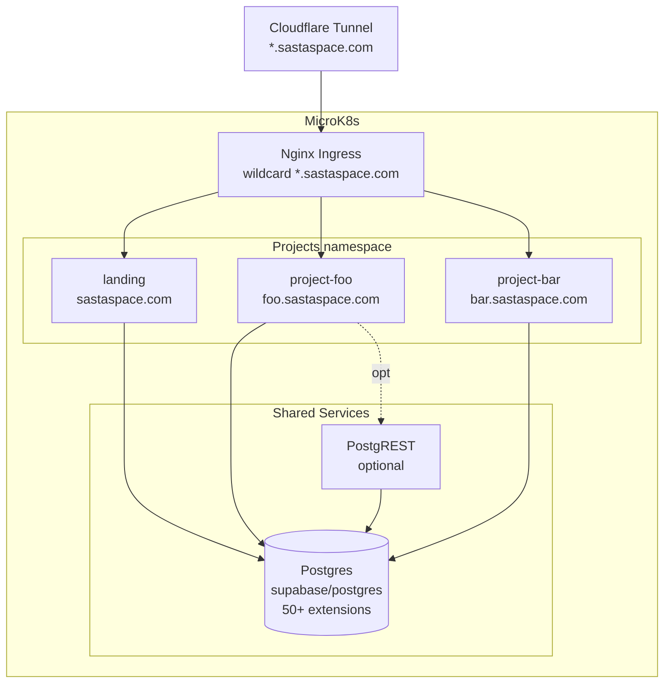

# Design Log 001 — Project Bank Foundations

**Status:** Draft — awaiting answers to open questions before implementation
**Date:** 2026-04-23
**Owner:** @mkhare

---

## Background

The current `sastaspace` repo is a single-purpose product: the **AI Website Redesigner**. It has accumulated a large surface area (FastAPI backend, Next.js redesign flow, swarm pipeline, `claude-code-api` sidecar, MongoDB, Redis, Browserless, Vikunja, EspoCRM, Grafana/Loki/Promtail, ~7 MB of screenshots, ~80 MB of submodules, ~135 MB of a scraped component catalog, ~1.6 MB of `plan_cache`, and ~1.2 GB of `node_modules`).

We've decided to pivot:

> Turn this repo into a **personal project bank** — a monorepo where many small personal projects live, each deployed on its own subdomain of `sastaspace.com`, sharing one Postgres (with all the plugins) as the universal data/AI layer. KISS throughout.

The existing redesigner work is being **archived** to a branch (`archive/redesigner`) and removed from `main`.

## Problem

Design a repo + deployment shape that:

1. Lets me scaffold a new project in minutes (not hours).
2. Shares one fat, feature-rich Postgres across every project so I rarely need to reach for Redis, Mongo, or a vector DB.
3. Deploys each project to `<name>.sastaspace.com` through the existing MicroK8s + Cloudflare tunnel with minimal per-project YAML.
4. Uses a high-performance compiled backend (Go or Rust) because the server is self-hosted and resources are finite.
5. Stays KISS — I should be able to read the whole infra in one sitting.

## Non-goals

- Multi-tenant SaaS for others. This is a personal showcase.
- Horizontal scale across nodes. Single MicroK8s node is fine.
- Zero-downtime everything. Rolling restarts are already fine.
- Supporting languages other than Go + TS (and Rust as an optional escape hatch for one project).

---

## Questions and Answers

> Per the design-log rule: questions stay; answers get appended. Please answer inline.

**Q1. Monorepo subdomain model — pinned.**
Each project under `projects/<name>/` deploys to `<name>.sastaspace.com`. Root domain `sastaspace.com` serves a portfolio landing page listing projects.
**Confirmed.**

**Q2. Backend language default — _needs your pick_.**
For a solo dev shipping many small projects on a resource-constrained self-hosted box:

- **Go (chi + pgx + sqlc)** — recommendation. Dev velocity: clean build ~2s, single static binary (~15 MB container), `pgx` is arguably the best Postgres driver in any ecosystem, `sqlc` gives type-safe Go from raw SQL (keeps you close to the DB, which matches the "use Postgres + plugins for everything" ethos). Throughput ~730k req/s in benchmarks — Postgres will be the bottleneck, not Go.
- **Rust (axum + sqlx)** — ~20% faster, ~40% less memory, no GC pauses. Cost: ~20x slower compiles (~40s clean), steeper cognitive load per project.
- **Hybrid** — Go by default, Rust allowed on a per-project basis for the one project that genuinely needs it.

**Recommended: Hybrid.** Go is the default template; a project can opt-into Rust if it has a specific reason (e.g. CPU-bound image/audio/ML work).

**A2:** ______________________________________________

**Q3. "Auto-backend" via PostgREST — worth it?**
`supabase/postgres` ships `pg_graphql` and pairs trivially with `PostgREST`. For projects that are "just CRUD over a schema", we can skip writing a Go backend entirely and let Postgres be the API (frontend talks directly to PostgREST with RLS for auth). Escape to Go only when we need custom logic.

**Options:**
- (a) **Yes, include PostgREST as a shared sidecar** — every project can expose its schema at `<name>.sastaspace.com/rest/*` for free, and write Go only when needed.
- (b) **No, always write a Go backend** — one way to do things.

**Recommended: (a).** Zero-cost for CRUD projects, Go is still there when we need it.

**A3:** ______________________________________________

**Q4. Shared vs per-project database.**

- (a) **One Postgres, one DB, one schema per project** (`project_foo`, `project_bar`). Migrations namespaced per project. Shared `public` schema for common things (domain mapping, visit counts).
- (b) **One Postgres, separate DB per project** — stronger isolation, slightly uglier ops.

**Recommended: (a).** Simpler connection management, same Postgres resources, cross-project queries possible if useful, RLS + schema grants provide isolation.

**A4:** ______________________________________________

**Q5. Auth layer.**
Most showcase projects won't need auth. For the few that do:

- (a) **No auth by default.** When needed, add `auth.users` table + JWT signed by `pgjwt` + RLS — no external service.
- (b) **Run the Supabase auth server (GoTrue)** as a shared sidecar alongside Postgres.
- (c) **Roll a tiny Go auth service** when the first project needs it.

**Recommended: (a)** until a project actually demands more. KISS.

**A5:** ______________________________________________

**Q6. Frontend framework default.**
Next.js 16 App Router (already in repo) or stay lighter with Astro / Vite + React / plain HTML-per-project?

**Recommended: Next.js as the default template, but the `_template` is just a suggestion — nothing prevents a project from being static HTML or Astro.**

**A6:** ______________________________________________

**Q7. Dev loop.**

- (a) **Docker Compose for local dev** that mirrors prod (Postgres + PostgREST + one project at a time). Run a single project with `make dev p=<name>`.
- (b) **Native dev** — run Postgres in Docker, everything else natively.

**Recommended: (a).** `make dev p=foo` brings up Postgres, PostgREST, the project's backend + frontend with hot reload. Identical to prod.

**A7:** ______________________________________________

**Q8. Migrations tool.**
- (a) **`atlas` or `goose`** — Go-native SQL migration tools, fit the Go-first theme.
- (b) **`sqitch`** — pure-SQL, language-agnostic.
- (c) **`dbmate`** — small, single binary.

**Recommended: `atlas`.** Schema-as-code support, plays well with sqlc, handles branching and diffing. If user prefers simplest, `dbmate` is a fine KISS choice.

**A8:** ______________________________________________

**Q9. Observability.**
Current Grafana/Loki/Promtail is getting nuked. Replace with:

- (a) **Nothing.** `kubectl logs` + Postgres `pg_stat_statements` is enough for a personal showcase.
- (b) **Postgres-native only.** Use `pg_stat_statements` + `pg_audit` + periodic Grafana Cloud free tier if ever needed.
- (c) **Bring back a minimal stack later.**

**Recommended: (a).** Add observability when a real project demands it.

**A9:** ______________________________________________

**Q10. Scrap-or-salvage from the current repo.**
Anything from the current redesigner worth keeping (even cherry-picked from `archive/redesigner`)?

Candidates:
- Turnstile + Resend contact form from `web/src/app/api/contact/route.ts` (useful on the portfolio landing page).
- `web/` Tailwind v4 + shadcn baseline (useful as starter for the Next.js template).
- `k8s/ingress.yaml` base (useful reference for the new wildcard ingress).
- `.github/workflows/deploy.yml` (useful reference for the new deploy pipeline).
- `cloudflared/config.yml` (useful — still needs a real tunnel UUID).

Everything else goes.

**A10:** ______________________________________________

---

## Design

### Repo layout

```
sastaspace/
├── design-log/                  # This folder. All significant designs start here.
│   └── 001-project-bank-foundations.md
├── infra/
│   ├── k8s/
│   │   ├── namespace.yaml
│   │   ├── postgres.yaml        # supabase/postgres StatefulSet + PVC + Service
│   │   ├── postgrest.yaml       # PostgREST Deployment + Service (if Q3=yes)
│   │   ├── ingress-wildcard.yaml# *.sastaspace.com wildcard ingress
│   │   └── cloudflared.yaml     # Cloudflare tunnel
│   ├── docker-compose.yml       # Local equivalent of the above
│   └── cloudflared/config.yml
├── db/
│   ├── migrations/              # Global migrations (auth.users, extensions, shared schema)
│   │   ├── 0001_enable_extensions.sql
│   │   └── 0002_shared_schema.sql
│   └── atlas.hcl                # Or dbmate config
├── projects/
│   ├── _template/               # `scripts/new-project.sh <name>` copies this
│   │   ├── README.md
│   │   ├── web/                 # Next.js (optional — delete if not needed)
│   │   ├── api/                 # Go (optional — delete if PostgREST-only)
│   │   ├── db/migrations/       # Project-scoped migrations on `project_<name>` schema
│   │   ├── Dockerfile.web
│   │   ├── Dockerfile.api
│   │   └── k8s.yaml             # Subdomain ingress rule + deployments
│   ├── landing/                 # sastaspace.com — portfolio page
│   └── <future projects>/
├── packages/                    # Shared Go + TS libraries (only when duplication hurts)
│   └── go-pgkit/                # Common pgx pool, retries, OTEL
├── scripts/
│   ├── new-project.sh           # Scaffold a new project from _template
│   ├── dev.sh                   # make dev p=<name>
│   └── migrate.sh               # Run migrations
├── .env.example
├── .gitignore
├── Makefile
├── README.md
├── CLAUDE.md                    # Updated for project bank context
└── AGENTS.md                    # Same content, alias
```

### Component topology



### Database layout

- `public` — shared reference tables (e.g. `projects`, `visits`, `contact_messages`).
- `auth` — reserved for future auth needs.
- `project_<name>` — one schema per project; each project owns its schema entirely.
- Extensions enabled once at the cluster level: `pgvector`, `postgis`, `pg_cron`, `pg_graphql`, `pg_net`, `pg_trgm`, `unaccent`, `pgjwt`, `pgcrypto`, `pgsql-http`, `plv8`, `pg_stat_statements`.
- Each project's migrations run as DB role `project_<name>` with `CREATE` only on its own schema. RLS policies gate PostgREST access.

### Per-project lifecycle

```mermaid
sequenceDiagram
    participant Dev
    participant Scripts
    participant Projects
    participant Postgres
    participant K8s
    Dev->>Scripts: ./scripts/new-project.sh foo
    Scripts->>Projects: cp _template/ -> projects/foo/
    Scripts->>Postgres: CREATE SCHEMA project_foo; CREATE ROLE project_foo
    Scripts->>Projects: stub first migration
    Dev->>Dev: write code, run `make dev p=foo`
    Dev->>Dev: git push
    K8s->>K8s: deploy.yml builds + applies projects/foo/k8s.yaml
    K8s->>Postgres: run migrations
    K8s->>Dev: foo.sastaspace.com is live
```

### Backend template (Go recommendation)

```
projects/_template/api/
├── go.mod
├── main.go                     # chi router, pgx pool, health, metrics
├── handlers/                   # HTTP handlers
├── db/
│   ├── queries.sql             # sqlc input
│   └── generated/              # sqlc output (gitignored? — open)
├── Dockerfile                  # FROM gcr.io/distroless/static → ~15MB
└── config.go                   # env-var config
```

### Ingress pattern

Wildcard ingress reads the `Host` header and routes `<name>.sastaspace.com` → service `<name>-web` in the `projects` namespace. Each project appends one `Ingress` rule via a Kustomize overlay, or contributes to a single `hosts.yaml` generated from `projects/*/k8s.yaml`.

---

## Implementation Plan

Phased. Each phase lands in its own commit(s). Stop between phases for sanity.

### Phase 0 — Archive & Reset (≈5 min)
1. `git checkout -b archive/redesigner` and push to origin.
2. `git checkout main`.
3. Delete the nuke list (see "Cleanup manifest" below) in a single commit: `chore: reset repo to project-bank foundations`.
4. Result: main is mostly empty — `README.md`, `LICENSE`, `.gitignore`, `design-log/`, `CLAUDE.md` stub remain.

### Phase 1 — Skeleton (≈30 min)
1. Create `infra/`, `db/`, `projects/`, `scripts/`, `packages/`.
2. Add root `README.md`, `Makefile`, `.env.example`, updated `.gitignore`.
3. Add `infra/docker-compose.yml` with only Postgres (supabase image) + PostgREST (if Q3=yes).
4. Add `db/migrations/0001_enable_extensions.sql` enabling all plugins the user picked.
5. Commit: `feat: add project-bank skeleton`.

### Phase 2 — Kubernetes (≈45 min)
1. `infra/k8s/namespace.yaml`, `postgres.yaml` (StatefulSet + PVC + Service), `postgrest.yaml`, `ingress-wildcard.yaml`, `cloudflared.yaml`.
2. Port and trim the current `.github/workflows/deploy.yml` to build/push/apply only what exists.
3. Commit: `feat: k8s manifests for shared postgres + wildcard ingress`.

### Phase 3 — `_template` (≈45 min)
1. `projects/_template/` with Next.js (Tailwind v4 + shadcn) + Go API (chi + pgx + sqlc) + per-project migration + project `k8s.yaml`.
2. `scripts/new-project.sh <name>` creates the schema/role and copies the template.
3. Commit: `feat: project scaffold template + new-project script`.

### Phase 4 — Landing (≈1 h)
1. First real project: `projects/landing/` — `sastaspace.com` portfolio page.
2. Reuses Turnstile + Resend contact form from the archive.
3. Reads the `public.projects` table for the list of live projects (one of which is itself).
4. Commit: `feat(landing): portfolio page`.

### Phase 5 — Docs (≈20 min)
1. Update `CLAUDE.md` to describe the new layout, conventions, deploy flow.
2. Short `README.md` at root + one in every `infra/`, `db/`, `projects/`.
3. Commit: `docs: refresh CLAUDE.md + READMEs for project bank`.

### Phase 6 — First migration to prod (≈30 min)
1. Deploy Postgres + PostgREST + landing to the MicroK8s server.
2. Point Cloudflare tunnel at `*.sastaspace.com`.
3. Verify `sastaspace.com` renders, Postgres is reachable in-cluster.
4. Commit (if any manifest tweaks): `chore(infra): wire up prod`.

---

## Cleanup manifest (Phase 0)

**Delete (from confirmed answers + user rule):**

- All root-level `*.png` screenshots (~30 files, ~7 MB).
- `plan_cache/` (1.6 MB).
- `claude-code-api/` (81 MB, git submodule-ish clone).
- `redesign-template/` (135 MB, vite playground with its own `node_modules`).
- `components/` (26 MB, scraped shadcn/21st-dev catalog).
- `sites/` (example redesigned sites).
- `.planning/`, `.claude-flow/`, `.swarm/`, `.playwright-mcp/` (stale agent state).
- `grafana/`, `loki/`, `promtail/` (unused monitoring configs per current CLAUDE.md).
- `sastaspace/` (entire Python backend module tree — crawler, redesigner, swarm, etc.).
- `backend/` (FastAPI Dockerfile + entrypoint).
- `web/` (current Next.js redesign app — will be reborn as `projects/landing/`).
- `tests/` (all Python tests — specific to redesigner).
- `cloudflared/`, `k8s/` — will be rebuilt under `infra/`.
- `docker-compose.yml` — will be rebuilt under `infra/`.
- `pyproject.toml`, `uv.lock`, `.venv/`, `.ruff_cache/`, `.pytest_cache/`, `.coverage` (Python stack goes away).
- `vulture_whitelist.py`, `Makefile` (will be rewritten).
- `.claude/` — Claude-specific config, stale.
- `audit-*.png`, `e2e-*.png`, `impexlift-*.png`, `mrbrownbakery-*.png`, `test*.png` (all the screenshot noise).
- `node_modules/` at root (not needed if everything lives under `projects/*/web/`).

**Keep (minimal survivors):**

- `.git/`, `.github/` (reset workflow in Phase 2).
- `.githooks/` (will review — probably keep).
- `.gitignore` (will update).
- `.dockerignore` (will update).
- `.trivyignore` (keep — security policy).
- `LICENSE`.
- `README.md` (will rewrite).
- `CLAUDE.md` (will rewrite).
- `.env.example` (will rewrite).
- `design-log/` (new).

---

## Examples

### Bad ❌ — per-project Postgres

```yaml
projects/foo/
  postgres.yaml   # ← never. one shared DB for everything.
projects/bar/
  postgres.yaml   # ← never.
```

### Good ✅ — shared Postgres, project schemas

```sql
-- db/migrations/0001_enable_extensions.sql
CREATE EXTENSION IF NOT EXISTS vector;
CREATE EXTENSION IF NOT EXISTS postgis;
CREATE EXTENSION IF NOT EXISTS pg_cron;
CREATE EXTENSION IF NOT EXISTS pg_graphql;
CREATE EXTENSION IF NOT EXISTS pg_trgm;
CREATE EXTENSION IF NOT EXISTS unaccent;
CREATE EXTENSION IF NOT EXISTS pgcrypto;
CREATE EXTENSION IF NOT EXISTS pg_stat_statements;

-- projects/foo/db/migrations/0001_init.sql
CREATE SCHEMA IF NOT EXISTS project_foo AUTHORIZATION project_foo;
SET search_path TO project_foo;
CREATE TABLE widgets ( id bigserial PRIMARY KEY, … );
```

### Good ✅ — Go handler with sqlc + pgx

```go
// projects/_template/api/handlers/widgets.go
func (h *Handler) ListWidgets(w http.ResponseWriter, r *http.Request) {
    widgets, err := h.q.ListWidgets(r.Context())
    if err != nil { http.Error(w, err.Error(), 500); return }
    json.NewEncoder(w).Encode(widgets)
}
```

### Good ✅ — per-project `k8s.yaml`

```yaml
# projects/foo/k8s.yaml — ~30 lines total
apiVersion: apps/v1
kind: Deployment
metadata: { name: foo-web, namespace: projects }
spec: { ... image: localhost:32000/foo-web:latest ... }
---
apiVersion: v1
kind: Service
metadata: { name: foo-web, namespace: projects }
spec: { selector: { app: foo-web }, ports: [{ port: 80, targetPort: 3000 }] }
---
apiVersion: networking.k8s.io/v1
kind: Ingress
metadata: { name: foo, namespace: projects }
spec:
  ingressClassName: nginx
  rules:
    - host: foo.sastaspace.com
      http: { paths: [{ path: /, pathType: Prefix, backend: { service: { name: foo-web, port: { number: 80 }}}}]}
```

---

## Trade-offs

| Choice | Pro | Con | Mitigation |
|---|---|---|---|
| One shared Postgres | One service, one backup, cheap | Noisy neighbor between projects | `pg_stat_statements` + resource limits on pod |
| Supabase image | 50+ extensions pre-built | ~600 MB image, specific PG version cadence | Pinned tag, weekly pull |
| Go default | Fast compile, small binaries, pgx is best-in-class | ~20% slower than Rust | Rust allowed per-project when it matters |
| PostgREST on every project | Zero-backend for CRUD | One more service to keep healthy | Single shared deployment, 1 replica |
| Subdomain per project | Clean URLs, CORS-free, easy deletes | One ingress rule per project | `new-project.sh` manages it |
| Monorepo | Atomic changes across projects + infra | Longer clone, more "everything in one place" | Single dev, no problem |
| Wildcard ingress | Add projects without ingress churn | TLS cert wildcard needed | Cloudflare tunnel terminates TLS — no cert mgmt in-cluster |
| Keep MicroK8s | Already working, already wired to deploy | More moving parts than Compose | Minimal manifests, one namespace |

---

## Open risks

1. **Cloudflare tunnel UUID is a placeholder** in the current repo. Phase 6 needs the real UUID or we get a black hole.
2. **`.github/workflows/deploy.yml` uses a self-hosted runner**. If the runner is wedged we can't deploy via CI. Fallback: `make deploy` rsync path — keep it working.
3. **Supabase image version pinning**: breaking major version upgrades of Postgres or extensions could bite. Pin to `17.6.x-tuned-*` and upgrade manually.

---

## What happens next

1. You answer **Q2–Q10** inline above (A2 … A10). Even a one-word answer per Q is fine.
2. I update this log, mark it approved, and start **Phase 0**.
3. Between each phase I pause for a quick look-see.
