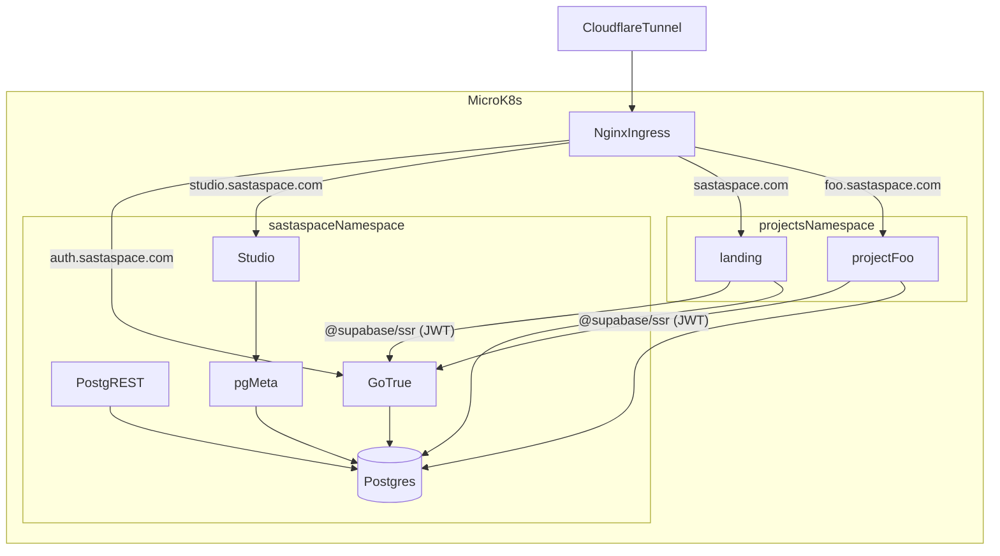

# Design Log 002 — Auth, Admin UI, and Template Visual Upgrade

**Status:** Approved — executing
**Date:** 2026-04-23
**Owner:** @mkhare
**Depends on:** [001-project-bank-foundations.md](001-project-bank-foundations.md)

---

## Background

Foundations (Design Log 001) are live on `main`. We have a monorepo with `supabase/postgres` + `PostgREST` shared services, a `_template`, and a `landing` project. The next question is how to give every project a shared **auth layer + admin UI**, and how to level up the `_template` so every new project starts beautiful and consistent.

## Locked decisions

| # | Decision | Choice |
|---|---|---|
| A1 | Auth/admin path | **Path A full** — Supabase-lite: GoTrue + Studio + PostgREST as shared services |
| A2 | UI upgrade scope | **Full pack**: shadcn component library, dark mode, layout shell, motion, data-table |

## Scope

**Added to `infra/k8s/`:**
- `gotrue.yaml` — GoTrue (Supabase Auth) deployment + service
- `studio.yaml` — Supabase Studio deployment + service
- `pg-meta.yaml` — `postgres-meta` deployment + service (required by Studio)
- `auth-ingress.yaml` — host rules for `auth.sastaspace.com` (GoTrue) and `studio.sastaspace.com` (Studio)
- Updates to `secrets.yaml.template` for new env keys

**Added to `infra/docker-compose.yml`:**
- Mirror of the above three services for local dev parity

**Added to `db/migrations/`:**
- `0003_auth_schema.sql` — creates the `auth` schema and required roles for GoTrue (`supabase_auth_admin`, `authenticated`, `service_role`) *if not already provisioned by GoTrue itself*
- `0004_rls_helpers.sql` — helper functions `auth.uid()`, `auth.role()` usable in RLS policies

**Added to `projects/_template/web/`:**
- Full shadcn installation (`components.json`, `src/components/ui/*`) — `button`, `input`, `label`, `card`, `form`, `dialog`, `dropdown-menu`, `sheet`, `tabs`, `navigation-menu`, `toast`, `skeleton`, `badge`, `avatar`, `separator`, `table`, `data-table` (with `@tanstack/react-table`)
- `src/components/layout/` — `app-shell.tsx`, `topbar.tsx`, `sidebar.tsx`, `footer.tsx`
- `src/components/theme/` — `theme-provider.tsx`, `theme-toggle.tsx` (using `next-themes`)
- `src/app/globals.css` — design-token CSS vars (light + dark) using the shadcn "neutral" baseline, overridable per-project
- `src/app/layout.tsx` — wraps children in `<ThemeProvider>`, loads Inter via `next/font`
- `src/lib/supabase/{client.ts,server.ts,middleware.ts}` — `@supabase/ssr` setup
- `src/app/(auth)/sign-in/page.tsx`, `sign-up/page.tsx`, `forgot-password/page.tsx` — ready-made auth pages
- `src/middleware.ts` — refreshes Supabase auth cookies on every request
- `src/app/(admin)/admin/users/page.tsx` — example gated admin page (role check via `auth.role()`)
- `motion` dependency installed; `src/components/motion/` — small wrapper primitives

**Added to `projects/_template/`:**
- `.env.example` entries for `NEXT_PUBLIC_SUPABASE_URL`, `NEXT_PUBLIC_SUPABASE_ANON_KEY`, `SUPABASE_SERVICE_ROLE_KEY`

**Removed from template:**
- The stubbed `ui/button.tsx`, `ui/input.tsx`, `ui/card.tsx` placeholders (replaced by real shadcn versions)

## Non-goals

- Supabase **Storage**, **Realtime**, **Edge Functions** — skipped until a specific project needs them.
- Self-hosted Kong API gateway — we route via existing Nginx ingress directly to GoTrue.
- Row Level Security *policies* for every project's data — only helpers + one example; each project owns its policies.

## Architecture

## Open implementation questions

Please answer inline; execution happens after.

**Q1. OAuth providers to enable at launch.**
**A1:** Email/password, Magic links (OTP), Google, GitHub. (Apple, Discord skipped for now.)

**Q2. SMTP provider for GoTrue.**
**A2:** Reuse **Resend** via SMTP relay (`smtp.resend.com`, port 465, user `resend`, password = existing `RESEND_API_KEY`).

**Q3. Studio access protection.**
**A3:** **Cloudflare Access** in front of `studio.sastaspace.com`. Single Zero-Trust rule: email in allowlist.

**Q4. Initial admin identity.**
**A4:** `mohitkhare582@gmail.com`. Seeded into `public.admins` allowlist at bootstrap; first sign-in auto-promotes that email's `auth.users` row.

**Q5. Design tokens / brand.**
**A5:** Neutral shadcn baseline in `_template`; each project overrides via its own `globals.css`.

**Q6. Motion library.**
**A6:** `motion` (motion.dev).

**Q7. Template auth UX.**
**A7:** Full: sign-in + sign-up + forgot-password + signed-out landing + protected `/admin`.

**Q8. Retrofit `projects/landing` in this pass?**
**A8:** Yes — add optional sign-in, show signed-in state, expose `/admin` gated to the admin allowlist.

## Implementation plan (preview)

Five phases, each one commit:

1. **Phase A — Shared services infra.** `gotrue`, `studio`, `pg-meta` in `infra/k8s/` + `docker-compose.yml`. Secrets template + docs.
2. **Phase B — DB auth plumbing.** `db/migrations/0003_auth_schema.sql`, `0004_rls_helpers.sql`, and role grants that mirror what GoTrue needs.
3. **Phase C — Template UI pack.** shadcn bulk install, layout shell, theme provider/toggle, data-table, motion, design tokens.
4. **Phase D — Template auth wiring.** `@supabase/ssr` client/server/middleware, auth pages, gated `/admin`, `.env.example` updates.
5. **Phase E — Docs.** Update `CLAUDE.md`, root `README.md`, `projects/_template/README.md`; append Implementation Results to this log.

Phase 6 (prod cutover for the new services) remains human-only.

## Risks

- **GoTrue + PostgREST share the same JWT secret.** Forgetting to set `PGRST_JWT_SECRET == GOTRUE_JWT_SECRET` silently breaks RLS auth. Mitigation: both read from the same k8s secret key.
- **Studio is powerful.** Anyone reaching the URL can `DROP TABLE`. Must be gated (see Q3).
- **GoTrue owns the `auth` schema.** Our migration must *not* recreate `auth.users`; only reference it.
- **Shadcn explosion.** Pulling 15+ components into `_template` adds surface. Mitigation: list is curated; projects are free to delete unused ones.
- **SSR auth cookies** in middleware can misbehave behind Cloudflare if Host headers are rewritten. Mitigation: set `trustHost` in Supabase client; verify in smoke test.

## What happens next

1. You answer Q1–Q8 inline above.
2. I generate a plan file (Design Log 002 → new `.plan.md`) with phase-by-phase todos, then execute A → E.
