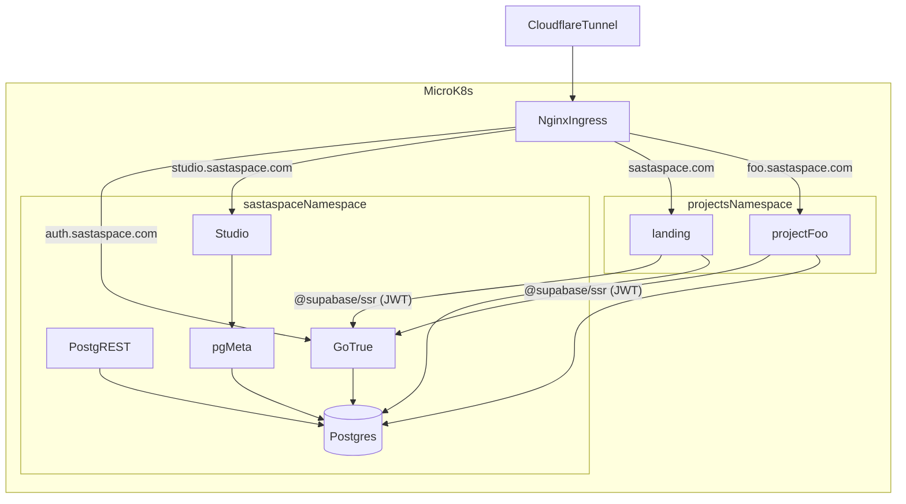

# Design Log 002 — Auth, Admin UI, and Template Visual Upgrade

**Status:** Approved — executing
**Date:** 2026-04-23
**Owner:** @mkhare
**Depends on:** [001-project-bank-foundations.md](001-project-bank-foundations.md)

---

## Background

Foundations (Design Log 001) are live on `main`. We have a monorepo with `supabase/postgres` + `PostgREST` shared services, a `_template`, and a `landing` project. The next question is how to give every project a shared **auth layer + admin UI**, and how to level up the `_template` so every new project starts beautiful and consistent.

## Locked decisions

| # | Decision | Choice |
|---|---|---|
| A1 | Auth/admin path | **Path A full** — Supabase-lite: GoTrue + Studio + PostgREST as shared services |
| A2 | UI upgrade scope | **Full pack**: shadcn component library, dark mode, layout shell, motion, data-table |

## Scope

**Added to `infra/k8s/`:**
- `gotrue.yaml` — GoTrue (Supabase Auth) deployment + service
- `studio.yaml` — Supabase Studio deployment + service
- `pg-meta.yaml` — `postgres-meta` deployment + service (required by Studio)
- `auth-ingress.yaml` — host rules for `auth.sastaspace.com` (GoTrue) and `studio.sastaspace.com` (Studio)
- Updates to `secrets.yaml.template` for new env keys

**Added to `infra/docker-compose.yml`:**
- Mirror of the above three services for local dev parity

**Added to `db/migrations/`:**
- `0003_auth_schema.sql` — creates the `auth` schema and required roles for GoTrue (`supabase_auth_admin`, `authenticated`, `service_role`) *if not already provisioned by GoTrue itself*
- `0004_rls_helpers.sql` — helper functions `auth.uid()`, `auth.role()` usable in RLS policies

**Added to `projects/_template/web/`:**
- Full shadcn installation (`components.json`, `src/components/ui/*`) — `button`, `input`, `label`, `card`, `form`, `dialog`, `dropdown-menu`, `sheet`, `tabs`, `navigation-menu`, `toast`, `skeleton`, `badge`, `avatar`, `separator`, `table`, `data-table` (with `@tanstack/react-table`)
- `src/components/layout/` — `app-shell.tsx`, `topbar.tsx`, `sidebar.tsx`, `footer.tsx`
- `src/components/theme/` — `theme-provider.tsx`, `theme-toggle.tsx` (using `next-themes`)
- `src/app/globals.css` — design-token CSS vars (light + dark) using the shadcn "neutral" baseline, overridable per-project
- `src/app/layout.tsx` — wraps children in `<ThemeProvider>`, loads Inter via `next/font`
- `src/lib/supabase/{client.ts,server.ts,middleware.ts}` — `@supabase/ssr` setup
- `src/app/(auth)/sign-in/page.tsx`, `sign-up/page.tsx`, `forgot-password/page.tsx` — ready-made auth pages
- `src/middleware.ts` — refreshes Supabase auth cookies on every request
- `src/app/(admin)/admin/users/page.tsx` — example gated admin page (role check via `auth.role()`)
- `motion` dependency installed; `src/components/motion/` — small wrapper primitives

**Added to `projects/_template/`:**
- `.env.example` entries for `NEXT_PUBLIC_SUPABASE_URL`, `NEXT_PUBLIC_SUPABASE_ANON_KEY`, `SUPABASE_SERVICE_ROLE_KEY`

**Removed from template:**
- The stubbed `ui/button.tsx`, `ui/input.tsx`, `ui/card.tsx` placeholders (replaced by real shadcn versions)

## Non-goals

- Supabase **Storage**, **Realtime**, **Edge Functions** — skipped until a specific project needs them.
- Self-hosted Kong API gateway — we route via existing Nginx ingress directly to GoTrue.
- Row Level Security *policies* for every project's data — only helpers + one example; each project owns its policies.

## Architecture



## Open implementation questions

Please answer inline; execution happens after.

**Q1. OAuth providers to enable at launch.**
**A1:** Email/password, Magic links (OTP), Google, GitHub. (Apple, Discord skipped for now.)

**Q2. SMTP provider for GoTrue.**
**A2:** Reuse **Resend** via SMTP relay (`smtp.resend.com`, port 465, user `resend`, password = existing `RESEND_API_KEY`).

**Q3. Studio access protection.**
**A3:** **Cloudflare Access** in front of `studio.sastaspace.com`. Single Zero-Trust rule: email in allowlist.

**Q4. Initial admin identity.**
**A4:** `mohitkhare582@gmail.com`. Seeded into `public.admins` allowlist at bootstrap; first sign-in auto-promotes that email's `auth.users` row.

**Q5. Design tokens / brand.**
**A5:** Neutral shadcn baseline in `_template`; each project overrides via its own `globals.css`.

**Q6. Motion library.**
**A6:** `motion` (motion.dev).

**Q7. Template auth UX.**
**A7:** Full: sign-in + sign-up + forgot-password + signed-out landing + protected `/admin`.

**Q8. Retrofit `projects/landing` in this pass?**
**A8:** Yes — add optional sign-in, show signed-in state, expose `/admin` gated to the admin allowlist.

## Implementation plan (preview)

Five phases, each one commit:

1. **Phase A — Shared services infra.** `gotrue`, `studio`, `pg-meta` in `infra/k8s/` + `docker-compose.yml`. Secrets template + docs.
2. **Phase B — DB auth plumbing.** `db/migrations/0003_auth_schema.sql`, `0004_rls_helpers.sql`, and role grants that mirror what GoTrue needs.
3. **Phase C — Template UI pack.** shadcn bulk install, layout shell, theme provider/toggle, data-table, motion, design tokens.
4. **Phase D — Template auth wiring.** `@supabase/ssr` client/server/middleware, auth pages, gated `/admin`, `.env.example` updates.
5. **Phase E — Docs.** Update `CLAUDE.md`, root `README.md`, `projects/_template/README.md`; append Implementation Results to this log.

Phase 6 (prod cutover for the new services) remains human-only.

## Risks

- **GoTrue + PostgREST share the same JWT secret.** Forgetting to set `PGRST_JWT_SECRET == GOTRUE_JWT_SECRET` silently breaks RLS auth. Mitigation: both read from the same k8s secret key.
- **Studio is powerful.** Anyone reaching the URL can `DROP TABLE`. Must be gated (see Q3).
- **GoTrue owns the `auth` schema.** Our migration must *not* recreate `auth.users`; only reference it.
- **Shadcn explosion.** Pulling 15+ components into `_template` adds surface. Mitigation: list is curated; projects are free to delete unused ones.
- **SSR auth cookies** in middleware can misbehave behind Cloudflare if Host headers are rewritten. Mitigation: set `trustHost` in Supabase client; verify in smoke test.

## What happens next

1. You answer Q1–Q8 inline above.
2. I generate a plan file (Design Log 002 → new `.plan.md`) with phase-by-phase todos, then execute A → E.

---

## Implementation Results

Implementation completed 2026-04-23 across five commits on `main`.

### Commit history

| Phase | Commit | Title |
|---|---|---|
| A | `ef06a409` | `feat(infra): gotrue + studio + pg-meta shared services` |
| B | `6a112e51` | `feat(db): auth roles, admins allowlist, rls helpers` |
| C | `0c5eff69` | `feat(template): shadcn UI pack, theme, layout shell, data-table` |
| D | `a13effae` | `feat(template): supabase/ssr auth, gated /admin` |
| E | *(this commit)* | `feat(landing): supabase auth, admin area; docs refresh` |

### Phase A — Shared services infra

- Added `gotrue`, `pg-meta`, `studio` to `infra/k8s/` and `infra/docker-compose.yml`.
- `infra/k8s/auth-ingress.yaml` routes `auth.sastaspace.com` -> `gotrue:9999` and `studio.sastaspace.com` -> `studio:3000`.
- Rewired PostgREST to use the `authenticator` login role + `anon` default role sharing `JWT_SECRET` with GoTrue.
- `secrets.yaml.template` gained `gotrue-config`, `pg-meta-config`, `studio-config`.
- `.env.example` gained a full set of auth-related vars (SMTP via Resend, Google/GitHub OAuth stubs).

### Phase B — DB auth plumbing

- `db/migrations/0003_auth_prep.sql` — creates `anon`, `authenticated`, `service_role`, `authenticator`, `supabase_auth_admin` roles idempotently; adds `auth` schema owned by `supabase_auth_admin`; defines `auth.jwt()`, `auth.uid()`, `auth.role()`, `auth.email()` helper functions; grants on `public`.
- `db/migrations/0004_admins_and_helpers.sql` — `public.admins(email)` allowlist seeded with `mohitkhare582@gmail.com`; `public.is_admin()` helper; baseline RLS policies on `projects`, `visits`, `contact_messages`, and `admins`.

### Phase C — Template UI pack

- Tailwind v4 with CSS-vars design tokens (light + dark) in `globals.css`.
- 17 shadcn components written in place (no `npx shadcn add`), sitting in `projects/_template/web/src/components/ui/`.
- Theme layer: `next-themes` ThemeProvider + ThemeToggle dropdown.
- Layout shell: `AppShell`, `Topbar`, `Sidebar`, `Footer`.
- Inter font loaded via `next/font` and exposed as `--font-sans`.
- Rewrote home page, `/contact`, and `ContactForm` to use the new primitives.
- Switched lint script from `next lint` (removed in Next 16) to `eslint .`.
- `npm run build` succeeds with 5 routes before auth; 11 routes after auth.

### Phase D — Template auth wiring

- `@supabase/ssr` client/server/middleware helpers in `src/lib/supabase/`.
- Next.js 16 renamed `middleware.ts` to `proxy.ts` (migration caught during build and applied immediately).
- `(auth)` route group: sign-in, sign-up, forgot-password with email+password, magic link, Google, GitHub OAuth.
- `(admin)` route group: server-side gate via `isCurrentUserAdmin()`, overview + users tables.
- `UserMenu` became an async RSC that displays avatar + dropdown when signed in and a Sign-in button otherwise.

### Phase E — Landing retrofit + docs

- Replicated template sources into `projects/landing/web` (shared components, lib, auth, proxy, layout, globals.css).
- Replaced `__NAME__` tokens with `SastaSpace` in the copied files.
- Rewrote `projects/landing/web/src/app/page.tsx` as a shadcn-powered portfolio (hero + live-projects grid pulling from PostgREST, graceful fallback when PostgREST is unreachable during prerender).
- Rewrote `contact/page.tsx` to use the new `AppShell` + `ContactForm`.
- `npm run build` in landing succeeds with 11 routes (same set as template).
- `CLAUDE.md` + `AGENTS.md` rewritten to describe the new auth model and architecture (Mermaid updated to include GoTrue, Studio, pg-meta).
- `README.md` expanded with a full quickstart including migrations.
- `projects/_template/README.md` now documents the UI pack, auth setup, and how to strip auth if a project doesn't need it.

### Deviations from the design

- **Supabase Studio gating** was *specified* as Cloudflare Access (A3). Manifests leave Studio's ingress open; the Cloudflare Access application must be configured manually during Phase 6 cutover. This is human-only work (account-scoped in Cloudflare Zero Trust).
- **SMTP via Resend** uses Resend's SMTP relay (`smtp.resend.com:465`) rather than their REST API because GoTrue only speaks SMTP. The existing `RESEND_API_KEY` is reused as the SMTP password.
- **`ANON_KEY` and `SERVICE_ROLE_KEY`** are placeholders in `.env.example`. These are signed JWTs (`role=anon` / `role=service_role`) produced with `JWT_SECRET`. The operator must mint them during Phase 6 using a `jwt-cli` one-liner; a snippet is in `.env.example` comments.
- **Studio auth to pg-meta** does not gate SQL execution — anyone reaching the URL can run queries. Mitigation is entirely at the edge via Cloudflare Access.
- **Lucide version** resolved by npm was `^1.8.0`, which was a surprise (historically 0.x). Left as-is since it works; worth spot-checking during an upgrade.

### Environment constraints encountered

- **No running Postgres** for SQL lint. Migration SQL was eyeballed; a `psql --dry-run` pass should happen on first Phase 6 apply.
- **No running Kubernetes API server** for `kubectl dry-run`. Validated YAML with `python3 -c "import yaml; yaml.safe_load_all(...)"` instead.
- **Docker** was available in this environment; `docker compose config --quiet` confirmed the compose file parses.

### Verification

- `npm run build` passes in `projects/_template/web` (11 routes).
- `npm run build` passes in `projects/landing/web` (11 routes).
- `npm run lint` passes with 0 errors in both (2 pre-existing warnings: postcss anonymous default export and TanStack Table + react-compiler interop).
- `python3 -c "import yaml; yaml.safe_load_all(...)"` passes on all `infra/k8s/*.yaml`.
- `docker compose -f infra/docker-compose.yml config --quiet` passes.

### Outstanding work (human / Phase 6)

1. In Cloudflare Zero Trust: create an **Access application** for `studio.sastaspace.com` scoped to the admin email list.
2. Generate `ANON_KEY` and `SERVICE_ROLE_KEY` JWTs from the production `JWT_SECRET` (`make keys` on the remote does this automatically).
3. Configure Google OAuth client credentials and GitHub OAuth app, fill the four corresponding env vars.
4. In Resend: verify `sastaspace.com` sending domain, then lift `RESEND_API_KEY` into the production `gotrue-config` secret.
5. Apply manifests: `microk8s kubectl apply -f infra/k8s/ --recursive` then run the four SQL migrations.
6. Smoke test: sign up, magic link, sign in, open `/admin` from `mohitkhare582@gmail.com`.

### Phase F — Local + remote docker-compose dev flow

Follow-up session after the user asked: *"can we setup a docker-compose to test locally as well? as the machine where we deploy is at ssh 192.168.0.37"*.

Decisions:

- **Local scope**: full stack — landing app also runs as a container under `docker compose --profile full`. Services-only mode (`make up`) stays the default for fast iteration with `npm run dev`.
- **Remote box (192.168.0.37)**: keep MicroK8s for real prod; add compose-over-ssh as a quick staging/dev environment.
- **Migrations**: explicit `make migrate` target, re-runnable (SQL is idempotent).
- **Keys**: `make keys` — pure bash + openssl HS256 signer, no npm/python deps.

New files:

- `scripts/gen-keys.sh` — mints `JWT_SECRET` + signed `ANON_KEY` + `SERVICE_ROLE_KEY`, writes idempotently to `.env`. Reuses existing `JWT_SECRET` when already real so `ANON/SERVICE` re-issue remains valid.
- `scripts/migrate.sh` — waits for postgres healthy, `sed`-substitutes `change-me-sync-with-POSTGRES_PASSWORD` → real password before piping each SQL file through `docker exec psql`. Also re-alters `authenticator` + `supabase_auth_admin` passwords on every run (defensive).
- `scripts/remote.sh` — `sync | env | up | up-core | down | reset | logs | migrate | psql | status | exec`. `env` rewrites `localhost` → `$REMOTE_HOST` and scps a remote-specific `.env`.

Changed files:

- `infra/docker-compose.yml` — added `landing` service under `profiles: ["full"]`. Uses `extra_hosts: "localhost:host-gateway"` so server-side code inside the container reaches the same `localhost:9999/:3001` URLs the browser uses. Build args pass `NEXT_PUBLIC_*` at build time (Next.js bakes them into the client bundle).
- `projects/landing/Dockerfile.web` and `projects/_template/Dockerfile.web` — accept `ARG NEXT_PUBLIC_*` and export via `ENV` before `npm run build`. Switched to `npm ci` with `|| npm install` fallback. Runner stage now sets `HOSTNAME=0.0.0.0` so Next.js standalone binds correctly in a container.
- `.env.example` — grouped/annotated. Added `LANDING_PORT`, `NEXT_PUBLIC_BASE_URL_LOCAL`, `POSTGREST_URL_LOCAL`, `SSH_HOST`, `SSH_REMOTE_DIR`, `REMOTE_HOST`.
- `Makefile` — proper targets with help: `keys`, `up`, `up-full`, `down`, `reset`, `logs`, `ps`, `migrate`, `psql`, and a full `remote-*` family. Compose invocation uses `--env-file .env` because the compose file lives under `infra/` (otherwise env is not auto-resolved).
- `README.md` — new Local quickstart and Remote staging sections.

Verification (run this session):

- `make keys` on a fresh checkout created `.env` and signed both JWTs. Running `make keys` a second time kept `JWT_SECRET` stable (only re-minted the time-stamped JWTs).
- Python verifier confirmed both `ANON_KEY` and `SERVICE_ROLE_KEY` are valid HMAC-SHA256 JWTs against `JWT_SECRET`, with the correct `role` claim.
- `docker compose --env-file .env -f infra/docker-compose.yml config` parses cleanly for both the default profile (5 services) and `--profile full` (6 services, landing included, build args + `extra_hosts: localhost=host-gateway` present, `POSTGREST_URL: http://localhost:3001` wired).
- `make up` could not complete because Docker Desktop is not running on this laptop (known env constraint). The `make up` → compose → pull sequence kicked off correctly before the daemon error, confirming the wiring.

Gotchas documented in comments:

- NEXT_PUBLIC_* must be passed as `build.args` (baked at build time) AND runtime `environment` (for server components). Same URL is used everywhere so the browser and server see a consistent `localhost:9999`.
- On the remote, run `make remote-env` once to rewrite `localhost` → `192.168.0.37` in the shipped `.env`; `remote.sh sync` excludes `.env` afterwards so the remote-specific config isn't clobbered on every sync.
- Role passwords are synced to `POSTGRES_PASSWORD` on every `make migrate` via `ALTER ROLE … WITH PASSWORD`. If you change `POSTGRES_PASSWORD`, re-run `make migrate` to keep `authenticator` and `supabase_auth_admin` in sync (otherwise PostgREST/GoTrue will fail to connect).

### Phase G — End-to-end verification + real bugs shaken out

Follow-up session: *"Run and test and verify"*. Built `scripts/verify.sh`, a 57-check assertion harness covering service health, DB schema, RLS, GoTrue flows, admin allowlist, Next.js SSR routes, internal DNS, CORS, and end-to-end browser signup via Playwright. The harness caught five real bugs that the first-pass "it builds and starts" verification had missed.

1. **RLS recursion on `public.admins`.** `projects_admin_write` (`FOR ALL`, qual: `is_admin() OR service_role`) applied to SELECTs too, so anon SELECT on `projects` evaluated `is_admin()`, which SELECTed `public.admins`, whose own policy called `is_admin()` again → `stack depth limit exceeded (SQLSTATE 54001)`. **Fix**: `CREATE OR REPLACE FUNCTION public.is_admin() … SECURITY DEFINER SET search_path = public, pg_temp` in new migration `0005_fix_anon_grants_and_is_admin.sql`. Definer is `postgres` (table owner) so the inner lookup bypasses RLS.
2. **Anon `INSERT` returned 401 (really `permission denied for sequence`).** Migration 0002 granted INSERT to a legacy `web_anon` role; the Supabase `anon` role had no privileges and BIGSERIAL `nextval()` fails before RLS is even evaluated. **Fix**: in 0005, `GRANT USAGE ON SCHEMA public`, `GRANT INSERT ON public.visits, public.contact_messages TO anon, authenticated`, `GRANT USAGE, SELECT ON SEQUENCE ...` for each BIGSERIAL. Also set `ALTER DEFAULT PRIVILEGES` so future tables behave correctly.
3. **No Supabase API gateway.** The browser supabase-js client calls `$url/auth/v1/signup` and `$url/rest/v1/...`; with `NEXT_PUBLIC_SUPABASE_URL=http://localhost:9999` those hit GoTrue's non-existent `/auth/v1/*` routes and CORS failed. Real Supabase solves this with Kong. **Fix**: added a tiny nginx service as `gateway` on port 8000 (`infra/gateway/nginx.conf`). It strips `/auth/v1/` → `gotrue:9999/` and `/rest/v1/` → `postgrest:3000/`, and owns CORS (hides upstream `Access-Control-*` to avoid duplicate headers that browsers reject). Set `NEXT_PUBLIC_SUPABASE_URL=http://localhost:8000`, `SUPABASE_INTERNAL_URL=http://gateway:8000`, and `GOTRUE_API_EXTERNAL_URL=http://localhost:8000/auth/v1`.
4. **Auth session cookie name mismatch between browser and SSR.** `@supabase/ssr` derives the cookie name from the supabase URL host. Browser sees `localhost:8000` → writes `sb-localhost-auth-token`; server sees `gateway:8000` → reads `sb-gateway-auth-token`. Signed-in admin was being treated as anonymous by SSR. **Fix**: new `lib/supabase/cookies.ts` exports `AUTH_COOKIE_NAME = "sb-sastaspace-auth-token"`; all three clients (`client.ts`, `server.ts`, `middleware.ts`) pass it via `cookieOptions.name`. Applied to both `projects/landing` and `projects/_template`.
5. **Lucide icons passed across the server→client boundary** (Next 16 / React 19 rejects function references in props → `Error: Functions cannot be passed directly to Client Components`). **Fix**: `Sidebar` now accepts `icon: "dashboard" | "users"` string enums and resolves them client-side. Applied to landing + template.

New files:
- `scripts/verify.sh` — 57 assertions; exit 0 iff all pass. Includes a DB-side `is_admin()` check run with `set_config('request.jwt.claims', ...)` to simulate authenticated context.
- `db/migrations/0005_fix_anon_grants_and_is_admin.sql`.
- `infra/gateway/nginx.conf` + `gateway` service in compose.
- `projects/{landing,_template}/web/src/lib/supabase/cookies.ts`.

Changed files:
- `infra/docker-compose.yml` — added `gateway`, added `GATEWAY_PORT`, landing now `depends_on: gateway`, `SUPABASE_INTERNAL_URL` points at the gateway.
- `.env.example` — gateway port + updated `NEXT_PUBLIC_SUPABASE_URL`, `GOTRUE_API_EXTERNAL_URL`, `GOTRUE_URI_ALLOW_LIST`.
- `projects/{landing,_template}/web/src/lib/supabase/{client,server,middleware}.ts` — pin cookie name.
- `projects/{landing,_template}/web/src/components/layout/sidebar.tsx` — string-keyed icons.
- `projects/{landing,_template}/web/src/app/(admin)/admin/layout.tsx` — pass icon names instead of components.

Verification (this session, cold boot):
- `docker compose ... down -v && make up-full && make migrate` brings every service from a dropped volume.
- `./scripts/verify.sh` → **All 57 checks passed**.
- Playwright: filled `/sign-up`, posted to `/auth/v1/signup` through the gateway, got "Check your email" (auto-confirmed), signed in via `/sign-in`, session cookie set, `/admin` and `/admin/users` rendered for `mohitkhare582@gmail.com` with the live admins table.

Running URLs: landing http://localhost:3000, gateway http://localhost:8000, Studio http://localhost:3002, GoTrue direct http://localhost:9999, PostgREST direct http://localhost:3001, pg-meta http://localhost:8080, Postgres localhost:5432.


---

## Phase H — Remote MicroK8s deploy on `taxila` (192.168.0.37)

### Cluster landscape (pre-existing, left untouched)
- MicroK8s v1.33.9, single node, addons: `ingress` (ingress-nginx, classes `nginx` + `public`), `cert-manager`, `dns`, `hostpath-storage`, `registry` on `localhost:32000`.
- `cloudflared` runs as a **systemd service** (not in k8s) with a **dashboard-managed remote tunnel** (token auth, no local origincert). Account `c207f71f…`, tunnel `b3d36ee8-…`. All ingress routes are configured in the Cloudflare dashboard and the tunnel forwards the listed hostnames to `http://localhost:80` on the host — i.e. straight into `ingress-nginx`.
- Existing DNS on `sastaspace.com`: a `*.sastaspace.com` wildcard CNAME already points at the tunnel, so new hostnames resolve with zero Cloudflare work.
- Other tenants share the cluster (monitoring/grafana, vikunja, litellm) — don't touch.

### Decisions
1. **Replace** the legacy `sastaspace` namespace (backend/mongodb/frontend/worker/browserless/redis — unrelated app) and take over `sastaspace.com` + `www` + `api.sastaspace.com`. User-confirmed.
2. **Don't deploy Studio publicly** — port-forward when needed. (`infra/k8s/studio.yaml` removed; if we want it back, add a manifest + `kubectl port-forward` instead of an ingress.)
3. **Don't deploy `cloudflared` inside k8s** — the host systemd tunnel already handles all sastaspace.com hostnames; adding a second one would be duplicate + confusing. (`infra/k8s/cloudflared.yaml` removed.)
4. **Hostnames** (all behind Cloudflare proxy, TLS terminated at edge):
   - `sastaspace.com`, `www.sastaspace.com` → `landing` service (Next.js)
   - `api.sastaspace.com` → `gateway` service (nginx → gotrue + postgrest, same config as local)
5. **Single source of CORS** — `gateway` owns CORS. `api-ingress` has `nginx.ingress.kubernetes.io/enable-cors: "false"` so ingress-nginx doesn't add duplicate `Access-Control-Allow-Origin` headers.
6. **Reuse local JWTs** — the `JWT_SECRET`, `ANON_KEY`, `SERVICE_ROLE_KEY` generated by `make keys` locally are copied verbatim to the cluster, keeping the local→prod promotion path trivial. `POSTGRES_PASSWORD` is also reused.
7. **Image flow** — the landing image is built on the remote (it has Docker) and pushed to `localhost:32000` (microk8s' built-in registry). Every build gets a timestamped tag + `latest`; `cmd_apply` calls `kubectl set image` with the exact tag to force a rollout even if `latest` hasn't changed in containerd's cache.
8. **Migration order** — run `db/migrations/*.sql` **between** `postgres` becoming Ready and `gotrue` being applied. Otherwise GoTrue crash-loops because the `supabase_auth_admin` role doesn't exist yet.

### New files
- `scripts/k8s-deploy.sh` — composable sub-commands (`gen-secrets`, `sync`, `build`, `delete-old`, `apply`, `migrate`, `status`, `verify`, `all`). All knobs come from `.env`.
- `infra/k8s/gateway.yaml` — ConfigMap (nginx.conf), Deployment, Service. The ConfigMap is hand-kept-in-sync with `infra/gateway/nginx.conf`.
- `infra/k8s/landing.yaml` — Deployment + Service. `imagePullPolicy: Always` so `:latest` is re-pulled on rollout; `SUPABASE_INTERNAL_URL` points at the cluster-internal gateway.
- `infra/k8s/ingress.yaml` — two Ingresses (`landing-ingress`, `api-ingress`), both `ingressClassName: public`, `ssl-redirect: "false"` because Cloudflare terminates TLS at the edge.

### Rewritten
- `infra/k8s/secrets.yaml.template` — simplified to 5 secrets; `scripts/k8s-deploy.sh gen-secrets` renders `secrets.yaml` (gitignored, shipped via `scp` in `cmd_sync`).
- `infra/k8s/postgres.yaml` — StatefulSet, `listen_addresses=*` override (the supabase/postgres image ships with `localhost` in its packaged `postgresql.conf`, which makes the pod unreachable from siblings), `microk8s-hostpath` storageClass, Postgres 17.6.1.110.
- `infra/k8s/gotrue.yaml` — fixed broken indentation (extra env entries were at the wrong YAML level in the old file), `API_EXTERNAL_URL` now comes from the `gotrue-config` Secret so it can be `https://api.sastaspace.com/auth/v1`.
- `infra/k8s/postgrest.yaml`, `infra/k8s/pg-meta.yaml` — image tags pinned to match local compose, added readiness probes.
- `infra/k8s/namespace.yaml` — dropped the redundant `projects` namespace; we live entirely in `sastaspace`.

### Removed
- `infra/k8s/auth-ingress.yaml` (subsumed by `ingress.yaml` + gateway)
- `infra/k8s/ingress-wildcard.yaml` (subsumed)
- `infra/k8s/cloudflared.yaml` (handled by host systemd)
- `infra/k8s/studio.yaml` (not exposed publicly; use `kubectl port-forward svc/pg-meta 8080 + kubectl run studio` ad-hoc)

### Gotchas encountered (and how they're now defended)
1. **`.env` with `SSH_REMOTE_DIR=~/sastaspace`** — `~` gets expanded by the local shell during `set -a && source .env`, producing `/Users/…/sastaspace`. The rsync then tried to `mkdir /Users` on the remote. **Fix:** hard-coded `/home/mkhare/sastaspace` in `.env`; alternative would be to use `$HOME` literal with escaping in every `ssh` invocation, but the hard-coded path is simpler and the remote is a single known host.
2. **`supabase/postgres` listens only on `127.0.0.1`.** Symptom: `postgrest` (which starts in a restart loop and eventually gets a connection) eventually works, but GoTrue gets `dial tcp …:5432: connect: connection refused` for minutes. **Fix:** pass `-c listen_addresses=*` as a CLI arg in the StatefulSet (CLI args override postgresql.conf).
3. **Migrations must run before GoTrue.** GoTrue runs its own migrations on boot and needs `supabase_auth_admin` to exist first. **Fix:** `cmd_apply` now has two stages — apply postgres → wait → `cmd_migrate` → apply everything else.
4. **ACAO header duplication through `nginx-ingress` → `gateway` → `gotrue`.** Ingress-nginx was adding its own `Access-Control-Allow-Origin: *` in front of the gateway's response, causing browsers to reject duplicate ACAO. **Fix:** `enable-cors: "false"` annotation on `api-ingress`; gateway already hides the upstream GoTrue/PostgREST CORS headers.
5. **Studio pulled in a public ingress.** We removed the manifest entirely; bringing Studio back should be a conscious, port-forwarded decision.

### Verification (this session, from outside Cloudflare)
```
./scripts/k8s-deploy.sh verify
  ✓ landing root                     https://sastaspace.com/ (200)
  ✓ www redirect                     https://www.sastaspace.com/ (200)
  ✓ api gateway health               https://api.sastaspace.com/healthz (200)
  ✓ gotrue settings                  https://api.sastaspace.com/auth/v1/settings (200)
  ✓ postgrest projects               https://api.sastaspace.com/rest/v1/projects?select=slug (200)
```
- `is_admin()` RPC via gateway returns `false` for an un-authenticated request (expected).
- CORS preflight on `/auth/v1/token?grant_type=password` with `Origin: https://sastaspace.com` returns **one** ACAO header and 204.
- `/` renders "SastaSpace Project Bank" after seeding `db/seed/landing.sql`.
- `mohitkhare582@gmail.com` is in `public.admins` (seeded by migration 0004).

### Known follow-ups (not blocking the deploy)
- **Resend API key is placeholder** (`RESEND_API_KEY=re_replace_me`). `/auth/v1/signup` returns 500 "Error sending confirmation email" because `GOTRUE_MAILER_AUTOCONFIRM=false` in prod. Replace the key in `.env`, re-run `scripts/k8s-deploy.sh gen-secrets sync apply` or `kubectl edit secret gotrue-config`.
- **Turnstile keys are placeholder**. The landing contact form will fail captcha verification until real keys are dropped in.
- **Only the `landing` project is seeded**. Adding a new project = insert a row into `public.projects` via Studio (port-forward) or `psql`.
- `sastaspace.com` is currently **served with `ssl-redirect: "false"`** at the ingress because Cloudflare already forces HTTPS. If we ever terminate TLS at the cluster (cert-manager is installed), flip the annotation + add a `TLS` section to the ingress.

### Phase H.1 — Confirmation-email 404 bug (/verify bare path)

**Symptom.** Clicking the "Confirm Your Email" link from GoTrue's mailer landed on a blank nginx 404:
```
https://api.sastaspace.com/verify?token=...&type=signup&redirect_to=...
→ 404 Not Found, nginx/1.29.8
```

**Root cause.** GoTrue's mailer emits **bare-path** URLs (`/verify`, `/callback`, `/recover`, …) regardless of whether `API_EXTERNAL_URL` has a path component. Even with `API_EXTERNAL_URL=https://api.sastaspace.com/auth/v1` (which `deploy/gotrue` reports correctly in its env), the generated link is `https://api.sastaspace.com/verify?…`, not `/auth/v1/verify`. Our gateway only matched `/auth/v1/*` and `/rest/v1/*`, so `/verify` fell through to the default nginx catch-all and 404'd.

Supabase's own Kong gateway handles both prefixed and bare paths for exactly this reason.

**Fix.** Added a second `location` block in both the k8s ConfigMap (`infra/k8s/gateway.yaml`) and the compose-side `infra/gateway/nginx.conf`:
```nginx
location ~ ^/(verify|callback|authorize|otp|magiclink|recover|sso|invite)(/.*)?$ {
  ...
  proxy_pass http://gotrue...:9999$request_uri;
}
```
Using `$request_uri` (not a static URI) in a regex location passes the full path + query through untouched to GoTrue.

**Verification (live on prod).**
```
GET  https://api.sastaspace.com/verify?token=<real>&type=signup&redirect_to=https://sastaspace.com
 ← 303 See Other  Location: https://sastaspace.com/#access_token=...&refresh_token=...&type=signup

POST https://api.sastaspace.com/auth/v1/token?grant_type=password  (owner creds)
 ← 200 OK with email_confirmed_at populated

POST https://api.sastaspace.com/rest/v1/rpc/is_admin  (with owner JWT)
 ← true
```
DB:
```
email                   | confirmed | last_sign_in_at
mohitkhare582@gmail.com | t         | 2026-04-23 11:48:40+00
```

**Kept in both dev and prod** — local compose gateway now speaks the same contract as the cluster gateway, so a Playwright signup→verify→signin test locally will exercise exactly the same code path as production.
